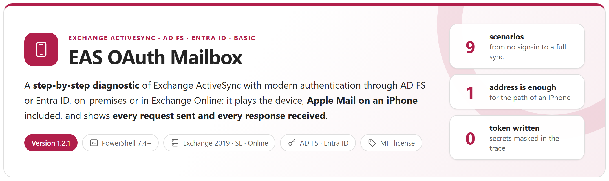
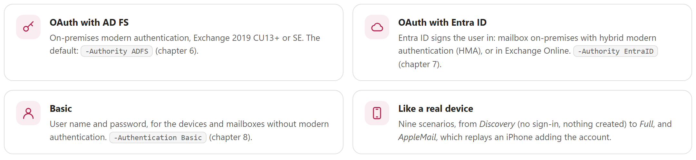
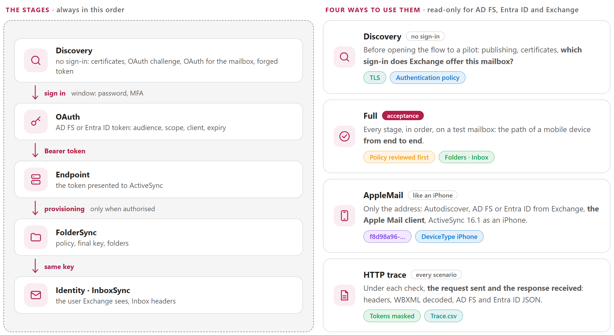
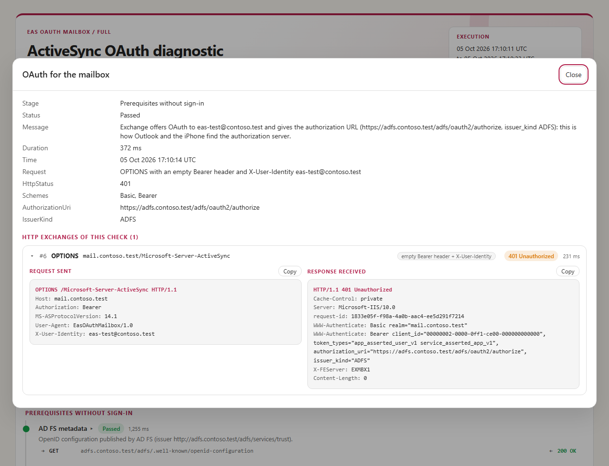
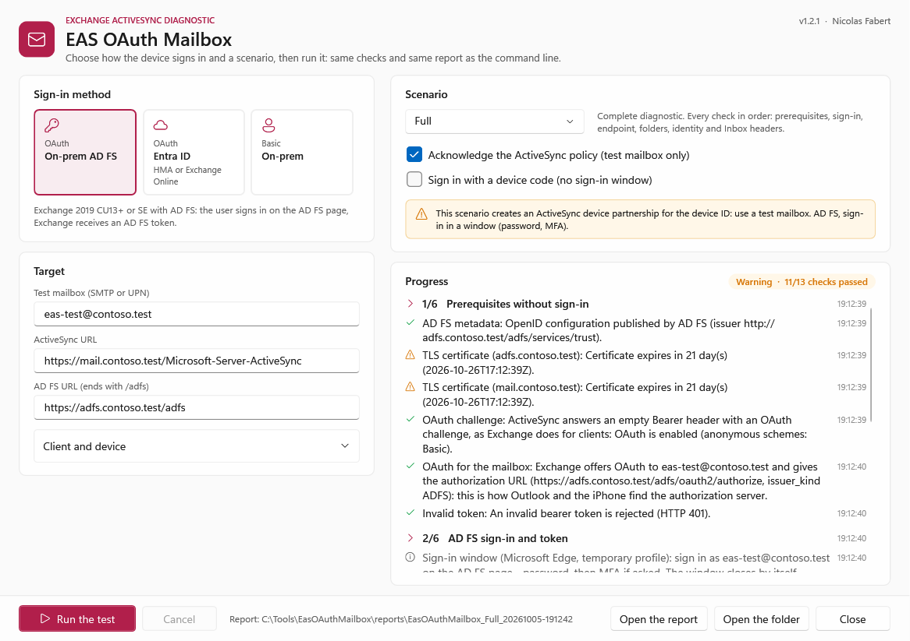

<p align="center">
  <picture>
    <source media="(prefers-color-scheme: dark)" srcset="package/docs/images/readme-banner-dark.png">
    
  </picture>
</p>

<p align="center">
  <a href="#why"><b>Why</b></a> &nbsp;&middot;&nbsp;
  <a href="#how-it-works"><b>How it works</b></a> &nbsp;&middot;&nbsp;
  <a href="#apple-mail-on-an-iphone"><b>Apple Mail on an iPhone</b></a> &nbsp;&middot;&nbsp;
  <a href="#reports"><b>Reports</b></a> &nbsp;&middot;&nbsp;
  <a href="#quick-start"><b>Quick start</b></a> &nbsp;&middot;&nbsp;
  <a href="package/docs/EasOAuthMailbox-UserGuide.md"><b>User guide</b></a> &nbsp;&middot;&nbsp;
  <a href="package/docs/EasOAuthMailbox-Guide.md"><b>Developer guide</b></a>
</p>

> [!IMPORTANT]
> Files downloaded from the Internet may be blocked by Windows and fail to run. Before using this project, unblock every file in the downloaded folder:
>
> ```powershell
> Get-ChildItem "C:\Chemin\Du\Dossier" -Recurse -File -Force | Unblock-File
> ```
>
> Replace the example path with the folder where you downloaded or extracted this project.

## Why

Since Exchange Server 2019 CU13 and Exchange Server SE, ActiveSync devices can sign in with **OAuth**: through **AD FS** without any hybrid configuration, or through **Entra ID** with hybrid modern authentication (HMA) — and in **Exchange Online**, Entra ID is the only way. The path of a device crosses many parts that each fail in their own way: the HTTPS publishing, the authorization server (AD FS application group, or Entra ID tenant and Conditional Access), the server declared in Exchange, the **authentication policy of the user**, the ActiveSync mailbox policy, the mailbox itself. And a phone says almost nothing about the failure: *cannot connect*, or a password prompt instead of the sign-in page.

This tool replays the same path from an administration workstation, **stage by stage**, with the three ways a device signs in — **OAuth with AD FS**, **OAuth with Entra ID**, **Basic** — and says for each check what works, what does not, and what to look at, with the request it sent and the response it received.

<picture>
  <source media="(prefers-color-scheme: dark)" srcset="package/docs/images/readme-principles-dark.png">
  
</picture>

## How it works

<picture>
  <source media="(prefers-color-scheme: dark)" srcset="package/docs/images/readme-how-it-works-dark.png">
  
</picture>

- **Before any sign-in** (`Discovery`): TLS certificates, the OAuth challenge of ActiveSync, AD FS metadata or the Entra ID tenant, a forged token that must be refused, and **which sign-in Exchange offers the tested mailbox** — AD FS, Entra ID, or none when the authentication policy of the user blocks modern authentication (the device then falls back to a password).
- **A sign-in like a mail app**: a window (Microsoft Edge or Google Chrome, temporary profile) opens the AD FS or Entra ID page, and the password and the MFA are typed there. Where no window can open (Server Core, no browser, a policy), a device code is shown to type on any other device.
- **The token itself**: audience, `scp` (`EAS.AccessAsUser.All`), client, tenant and expiry are compared with what Exchange expects — the most frequent cause of HTTP 401.
- **The answer of Exchange**: HTTP status, ActiveSync status in the WBXML and the `x-ms-diagnostics` reason are kept as they are.
- **Safe on a production organisation**: the ActiveSync policy is never acknowledged without `-AcknowledgePolicy` (it is downloaded for review, and the run stops as *Blocked*), a remote wipe is never acknowledged, and nothing is changed in AD FS, Entra ID or Exchange.

## Apple Mail on an iPhone

The `AppleMail` scenario replays what an iPhone does when an Exchange account is added — from a trace of a real iPhone. **Only the address is needed**: the ActiveSync URL comes from Autodiscover, the sign-in server (AD FS or Entra ID) from the Exchange challenge, and the sign-in uses the client of the Apple Mail app with the redirect URI of the iPhone, before ActiveSync 16.1 with the User-Agent and device type of an iPhone.

<picture>
  <source media="(prefers-color-scheme: dark)" srcset="package/docs/images/readme-iphone-dark.png">
  
</picture>

## Reports

<table>
  <tr>
    <td width="50%" valign="top"><a href="package/docs/images/eas-report-overview.png"></a><br><sub><b>HTML report</b> &middot; result, checks passed, folders, Inbox headers, and what was tested</sub></td>
    <td width="50%" valign="top"><a href="package/docs/images/eas-report-exchange.png"></a><br><sub><b>Request sent, response received</b> &middot; for every check: headers, WBXML decoded, AD FS and Entra ID JSON; tokens masked</sub></td>
  </tr>
  <tr>
    <td width="50%" valign="top"><a href="package/docs/images/eas-console-online.png"></a><br><sub><b>Console</b> &middot; a mailbox in Exchange Online, signed in with Entra ID, from the prerequisites to the Inbox headers</sub></td>
    <td width="50%" valign="top"><a href="package/docs/images/eas-gui.png"></a><br><sub><b>Window</b> &middot; choose the sign-in method and the scenario, follow the progress, open the report</sub></td>
  </tr>
</table>

Each run writes `Steps.csv` (one row per check), `Trace.csv` (every HTTP request and response), `Folders.csv`, `Messages.csv` (Inbox headers: date, sender, subject — no body, no attachment), `Policy.csv`, `Summary.json` and a self-contained HTML report.

## Requirements

| Item | Requirement |
|---|---|
| Workstation | Windows 10 / 11 or Windows Server 2016 to 2025, **PowerShell 7.4** or later (7.5 or later for the Windows 11 look of the window). No module to install. |
| Browser | Microsoft Edge or Google Chrome, for the sign-in window. Without one, a device code is shown instead. |
| Network | HTTPS to the ActiveSync URL, and to AD FS or `login.microsoftonline.com` |
| Account | A **test mailbox** and its password (and its MFA). From `FolderSync` on, Exchange registers an ActiveSync device partnership for it. |

And on the Exchange side, for the sign-in method you test:

| Sign-in method | Exchange side |
|---|---|
| **OAuth - On-prem AD FS** | Exchange Server 2019 CU13+ or SE configured for modern authentication with AD FS (AD FS on Windows Server 2019 or later), and an authentication policy that allows it for the user |
| **OAuth - Entra ID** | Exchange on-premises in hybrid with modern authentication (HMA) enabled, or a mailbox in Exchange Online |
| **Basic - On-prem** | Basic authentication allowed on the ActiveSync virtual directory |

## Quick start

**The simplest: the window.** Get the tool, replace the `contoso.test` values of the configuration — the test mailbox, the ActiveSync URL and, with AD FS, the AD FS URL — then open the window. Every value can also be typed in the window or given on the command line.

```powershell
git clone https://github.com/Nico77600/EasOAuthMailbox.git
cd EasOAuthMailbox\package
notepad .\config\EasOAuthMailbox.config.psd1
.\Invoke-EasOAuthMailbox.ps1 -Gui
```

Or from a release: download `EasOAuthMailbox-<version>.zip` from the [latest release](https://github.com/Nico77600/EasOAuthMailbox/releases/latest), extract it, for example in `C:\Tools`, and unblock the files (command at the top of this page), then:

```powershell
cd C:\Tools\EasOAuthMailbox-1.2.1
notepad .\config\EasOAuthMailbox.config.psd1
.\Invoke-EasOAuthMailbox.ps1 -Gui
```

Choose the sign-in method, check the mailbox and the URLs, choose the scenario, then **Run the test**. With OAuth, a sign-in window opens: type the password and the MFA there.

**From the command line** — what is not given comes from the configuration file:

```powershell
# Without signing in: certificates, OAuth challenge, and which sign-in Exchange offers this mailbox
.\Invoke-EasOAuthMailbox.ps1 -TestType Discovery -Mailbox eas-test@contoso.com

# Complete test of a test mailbox, with each sign-in method
.\Invoke-EasOAuthMailbox.ps1 -TestType Full -AcknowledgePolicy                          # OAuth - On-prem AD FS
.\Invoke-EasOAuthMailbox.ps1 -TestType Full -Authority EntraID -AcknowledgePolicy       # OAuth - Entra ID, Exchange on-premises (HMA)
.\Invoke-EasOAuthMailbox.ps1 -TestType Full -Authority EntraID -AcknowledgePolicy -EasUrl https://outlook.office365.com/Microsoft-Server-ActiveSync   # OAuth - Entra ID, Exchange Online
.\Invoke-EasOAuthMailbox.ps1 -TestType Full -Authentication Basic -AcknowledgePolicy    # Basic - On-prem (the password is asked)

# Like an iPhone: only the address, the rest comes from Autodiscover and Exchange
.\Invoke-EasOAuthMailbox.ps1 -TestType AppleMail -Mailbox eas-test@contoso.com -AcknowledgePolicy
```

The console shows each check as it runs, then the verdict and the path of the report; the exit code is `0` passed, `1` failed, `2` warnings or blocked. Which scenario to choose, what each option changes and how to read the report: the [user guide](package/docs/EasOAuthMailbox-UserGuide.md).

## Documentation

The `package` folder of this repository holds exactly the files needed to run the tool, with both guides. The zip of each [release](https://github.com/Nico77600/EasOAuthMailbox/releases) contains the same run-time files with the HTML guides; `.\tools\New-EasOAuthMailboxPackage.ps1` builds that zip content from the repository.

| Guide | Content |
|---|---|
| **[User guide](package/docs/EasOAuthMailbox-UserGuide.md)** | What you need to run a test: prerequisites, install, the window and the command line, which scenario to choose, how to read the console, the report and the files produced, and the usual symptoms. |
| **[Developer guide](package/docs/EasOAuthMailbox-Guide.md)** | For developers, and to go further in troubleshooting: the three sign-in methods with the AD FS, Entra ID and Exchange configuration they expect, every setting, each check with what to verify, the path of the iPhone, the reports and the HTTP trace, troubleshooting, the architecture of the module, the tests and how to evolve the tool. |

Both guides also exist as a single HTML file with a light and a dark theme (`package/docs/EasOAuthMailbox-UserGuide.html`, `package/docs/EasOAuthMailbox-Guide.html`): download them and open them locally, or use the copies in the zip of each release.

## Tests

```powershell
.\Run-Tests.ps1                              # Pester 6.1+, simulated AD FS, Entra ID and Exchange (WBXML built byte by byte), no connection
.\tools\New-DocumentationImages.ps1          # screenshots of the guides, rendered by the tool itself
.\tools\Build-Documentation.ps1              # the HTML guides
.\tools\New-ReadmeImages.ps1                 # the graphics of this page (light and dark)
.\tools\New-EasOAuthMailboxPackage.ps1       # builds the release zip content from package: run-time files and the HTML guides only
```

## License

[MIT](LICENSE).

## Disclaimer

This Script is a Personal project.
It's provided "AS-IS". It's not an official Microsoft product so no support can be expected from Microsoft.

As any scripts you must read carefully the documentation and test it first in a Test environment before any run in Production.

Use a test mailbox: from `FolderSync` on, Exchange registers an ActiveSync device partnership.