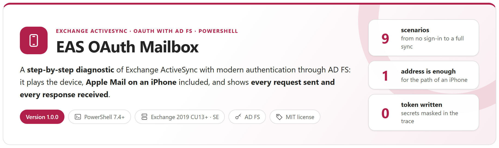
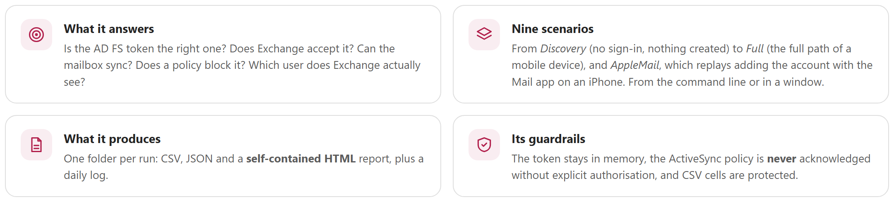
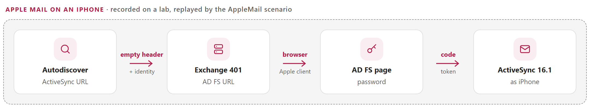

<p align="center">
  <picture>
    <source media="(prefers-color-scheme: dark)" srcset="docs/images/readme-banner-dark.png">
    
  </picture>
</p>

<p align="center">
  <a href="#why"><b>Why</b></a> &nbsp;&middot;&nbsp;
  <a href="#how-it-works"><b>How it works</b></a> &nbsp;&middot;&nbsp;
  <a href="#apple-mail-on-an-iphone"><b>Apple Mail on an iPhone</b></a> &nbsp;&middot;&nbsp;
  <a href="#reports"><b>Reports</b></a> &nbsp;&middot;&nbsp;
  <a href="#quick-start"><b>Quick start</b></a> &nbsp;&middot;&nbsp;
  <a href="docs/EasOAuthMailbox-Guide.md"><b>Administrator guide</b></a>
</p>

> [!IMPORTANT]
> Files downloaded from the Internet may be blocked by Windows and fail to run. Before using this project, unblock every file in the downloaded folder:
>
> ```powershell
> Get-ChildItem "C:\Chemin\Du\Dossier" -Recurse -File -Force | Unblock-File
> ```
>
> Replace the example path with the folder where you downloaded or extracted this project.

## Why

Since Exchange Server 2019 CU13 and Exchange Server SE, ActiveSync devices can sign in with **OAuth through AD FS**, without any hybrid configuration. The path of a device crosses many parts that each fail in their own way: the HTTPS publishing, the AD FS application group (clients, Web API, scopes, issuance rules), the authorization server declared in Exchange, the **authentication policy of the user**, the ActiveSync mailbox policy, the mailbox itself. And a phone says almost nothing about the failure: *cannot connect*, or a password prompt instead of the AD FS page.

This tool replays the same path from an administration workstation, **stage by stage**, and says for each check what works, what does not, and what to look at — with the request it sent and the response it received.

<picture>
  <source media="(prefers-color-scheme: dark)" srcset="docs/images/readme-principles-dark.png">
  
</picture>

## How it works

<picture>
  <source media="(prefers-color-scheme: dark)" srcset="docs/images/readme-how-it-works-dark.png">
  
</picture>

- **Before any sign-in** (`Discovery`): AD FS metadata, TLS certificates, the OAuth challenge of ActiveSync, a forged token that must be refused, and **whether Exchange gives the AD FS URL to the tested mailbox** — it does only when the authentication policy of the user allows modern authentication; otherwise the device falls back to a password.
- **The token itself**: audience, `scp` (`EAS.AccessAsUser.All`), client and expiry are compared with what Exchange expects — the most frequent cause of HTTP 401.
- **The answer of Exchange**: HTTP status, ActiveSync status in the WBXML and the `x-ms-diagnostics` reason are kept as they are.
- **Safe on a production organisation**: the ActiveSync policy is never acknowledged without `-AcknowledgePolicy` (it is downloaded for review, and the run stops as *Blocked*), a remote wipe is never acknowledged, and nothing is changed in AD FS or Exchange.

## Apple Mail on an iPhone

The `AppleMail` scenario replays what an iPhone does when an Exchange account is added — from a trace of a real iPhone on Exchange Server SE with AD FS. **Only the address is needed**: the ActiveSync URL comes from Autodiscover, AD FS from the Exchange challenge, and the sign-in uses the AD FS client of the Apple Mail app (`f8d98a96-0999-43f5-8af3-69971c7bb423`) before ActiveSync 16.1 with the User-Agent and device type of an iPhone.

<picture>
  <source media="(prefers-color-scheme: dark)" srcset="docs/images/readme-iphone-dark.png">
  
</picture>

## Reports

<table>
  <tr>
    <td width="50%" valign="top"><a href="docs/images/eas-report-overview.png"></a><br><sub><b>HTML report</b> &middot; result, checks passed, folders, Inbox headers, and what was tested</sub></td>
    <td width="50%" valign="top"><a href="docs/images/eas-report-exchange.png"></a><br><sub><b>Request sent, response received</b> &middot; for every check: headers, WBXML decoded, AD FS JSON; tokens masked</sub></td>
  </tr>
  <tr>
    <td width="50%" valign="top"><a href="docs/images/eas-console-apple.png"></a><br><sub><b>Console</b> &middot; the path of an iPhone, from the address to the Inbox headers</sub></td>
    <td width="50%" valign="top"><a href="docs/images/eas-gui.png"></a><br><sub><b>Window</b> &middot; choose a scenario, follow the progress, open the report</sub></td>
  </tr>
</table>

Each run writes `Steps.csv` (one row per check), `Trace.csv` (every HTTP request and response), `Folders.csv`, `Messages.csv` (Inbox headers: date, sender, subject — no body, no attachment), `Policy.csv`, `Summary.json` and a self-contained HTML report.

## Requirements

| Item | Requirement |
|---|---|
| PowerShell | 7.4 or later, Windows (the window uses Windows Forms) |
| Modules | None |
| Exchange | Exchange Server 2019 CU13 or later, or Exchange Server Subscription Edition, configured for modern authentication with AD FS |
| AD FS | Windows Server 2019 or later (device-code flow), the application group documented by Microsoft (native clients, one Web API per Exchange URL) |
| Account | A **test mailbox** whose authentication policy allows modern authentication for ActiveSync |

## Quick start

```powershell
git clone https://github.com/Nico77600/EasOAuthMailbox.git
cd EasOAuthMailbox
notepad .\config\EasOAuthMailbox.config.psd1             # AD FS URL, ActiveSync URL, test mailbox

.\Invoke-EasOAuthMailbox.ps1 -TestType Discovery          # no sign-in: certificates, OAuth challenge, mailbox policy, forged token
.\Invoke-EasOAuthMailbox.ps1 -TestType Endpoint           # is the AD FS token issued, then accepted by Exchange?
.\Invoke-EasOAuthMailbox.ps1 -TestType Full -AcknowledgePolicy                                # acceptance of a test mailbox
.\Invoke-EasOAuthMailbox.ps1 -TestType AppleMail -Mailbox eas-test@contoso.com -AcknowledgePolicy   # like an iPhone: only the address
.\Invoke-EasOAuthMailbox.ps1 -Gui                         # the same in a window
```

The zip of each [release](https://github.com/Nico77600/EasOAuthMailbox/releases) contains only the files needed to run, with the HTML guide. Exit codes: `0` passed, `1` failed, `2` warnings or blocked.

## Documentation

The **administrator guide** covers the scenarios, the expected AD FS and Exchange configuration, every setting, each check with what to verify, the path of the iPhone, the reports and the HTTP trace, troubleshooting and the internals:

- [docs/EasOAuthMailbox-Guide.md](docs/EasOAuthMailbox-Guide.md)
- `docs/EasOAuthMailbox-Guide.html` — the same guide as a single HTML file (download it and open it locally)

## Tests

```powershell
.\Run-Tests.ps1          # Pester 6.1+, simulated AD FS and Exchange (WBXML built byte by byte), no connection
```

`tools\New-DocumentationImages.ps1` renders the screenshots of the guide with the tool itself, `tools\Build-Documentation.ps1` rebuilds the HTML guide, `tools\New-ReadmeImages.ps1` renders the graphics of this page, and `tools\New-EasOAuthMailboxPackage.ps1` builds the release folder.

## License

[MIT](LICENSE).

## Disclaimer

Personal project, provided as is. It is not an official Microsoft product and is not supported by Microsoft. Use a test mailbox: from `FolderSync` on, Exchange registers an ActiveSync device partnership. Test it in your environment before production use.
