# EAS OAuth Mailbox — Administrator guide

> A step-by-step diagnostic of **Exchange ActiveSync** on Exchange Server and Exchange Online, for the three ways a mobile device signs in: **OAuth with AD FS**, **OAuth with Entra ID** (Exchange on-premises with hybrid modern authentication, or Exchange Online) and **Basic**. Each check says **what works, what does not and what to verify**, in the console, a window and an HTML report.

```cards
key | OAuth with AD FS | On-premises modern authentication, Exchange 2019 CU13+ or SE. The default: `-Authority ADFS` (chapter 6).
cloud | OAuth with Entra ID | Entra ID signs the user in: mailbox on-premises with hybrid modern authentication (HMA), or in Exchange Online. `-Authority EntraID` (chapter 7).
user | Basic | User name and password, for the devices and mailboxes without modern authentication. `-Authentication Basic` (chapter 8).
phone | Like a real device | Nine scenarios, from *Discovery* (no sign-in, nothing created) to *Full*, and *AppleMail*, which replays an iPhone adding the account.
```

## Quick start

```steps
Install | Copy the folder, unblock the files, check PowerShell 7.4 or later (chapter 10).
Configure | Replace every `contoso.test` value in `config\EasOAuthMailbox.config.psd1` (chapter 11).
Check without signing in | `.\Invoke-EasOAuthMailbox.ps1 -TestType Discovery`
Run the full test | `.\Invoke-EasOAuthMailbox.ps1 -TestType Full`, with `-Authority EntraID` or `-Authentication Basic` for the other paths — or `-Gui` to choose in a window. A sign-in window opens on the AD FS or Entra ID page: type the password, then the MFA.
Read the result | Open the HTML report named in the final card and stop at the first red or orange check (chapter 15).
```

> [!IMPORTANT]
> Use a **dedicated test mailbox**. From `FolderSync` on, Exchange records a device partnership (`Get-MobileDevice`). The ActiveSync policy is acknowledged only with `-AcknowledgePolicy`: without it, the policy is downloaded for review and the run stops as **Blocked**.

# Part I · Understand

<!-- icon: target -->
## 1. Purpose

A mobile device that fails only says “cannot connect”. Yet its path crosses many components, each failing in its own way: HTTPS publishing, the authorisation server (AD FS or Entra ID), the Exchange configuration, the authentication policy of the user, the ActiveSync policy and the mailbox. EAS OAuth Mailbox replays this path from an administration workstation and **isolates each stage**.

```cards
search | Before any sign-in | Certificates, the challenge of Exchange and the server it names for the mailbox, a forged token refused: no account needed.
key | The credentials | The token — audience, scope, expiry, user, tenant — or the user name and password, as Exchange receives them.
server | The Exchange answer | HTTP code, ActiveSync status and `x-ms-diagnostics`, kept as-is with each request.
people | The right user | The user Exchange associates with the credentials, compared with the tested mailbox.
```

The tool changes **no setting** in AD FS, Entra ID or Exchange, and reads no message body or attachment.

<!-- icon: flow -->
## 2. How it works

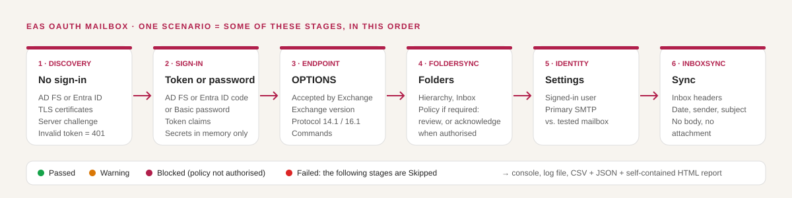

A scenario runs some of these stages, always in this order. They share the token or password (in memory only), the device ID, the policy key and the folders found.

| Stage | What is checked |
|---|---|
| **Discovery** | Metadata of AD FS or Entra ID, TLS certificates, the Exchange challenge and the server it names for the mailbox, a forged token refused. No sign-in. |
| **OAuth** · **Basic** | The sign-in: sign-in window (or device code) and token claims, or one request with the user name and password (chapters 5 to 8). |
| **AppleSetup** | What the iPhone does before the password: Autodiscover, the server named by Exchange, its sign-in page for the Apple Mail client. |
| **Endpoint** | `OPTIONS` with the credentials: accepted or not, Exchange version, protocols, commands. |
| **Provisioning** · **FolderSync** | The ActiveSync policy (acknowledged only when authorised), the folders, the Inbox. |
| **Identity** | The user Exchange sees (`Settings`), compared with the mailbox. |
| **InboxSync** | Up to `MessageCount` Inbox headers: date, sender, subject. |

The requests sent by each stage are described in chapter 14, and listed for each run in the *HTTP trace* of the report.

<!-- icon: layers -->
## 3. Scenarios

| Scenario | Stages | Sign-in | Device in Exchange |
|---|---|:---:|:---:|
| `Discovery` | Discovery | no | no |
| `OAuth` | OAuth | yes | no |
| `Endpoint` | sign-in, Endpoint | yes | no |
| `FolderSync` | sign-in, Endpoint, FolderSync | yes | yes |
| `Provisioning` | sign-in, Endpoint, Provisioning, FolderSync | yes | yes |
| `Identity` | sign-in, Endpoint, FolderSync, Identity | yes | yes |
| `InboxSync` | sign-in, Endpoint, FolderSync, InboxSync | yes | yes |
| `Full` | Discovery, sign-in, Endpoint, FolderSync, Identity, InboxSync | yes | yes |
| `AppleMail` | AppleSetup, sign-in, Endpoint, FolderSync, Identity, InboxSync — **as an iPhone** | yes (Apple client) | yes (`iPhone`) |

The sign-in stage is *OAuth* (AD FS or Entra ID) or *Basic*, depending on the path chosen (chapter 5). The `OAuth` scenario tests the token only and needs OAuth.

```cards
search | Validate a publication | `Discovery`, from outside and from inside: nothing is created.
key | Validate the sign-in | `OAuth`, then `Endpoint`: is the token issued, then accepted by Exchange?
folder | Validate a mailbox | `FolderSync`, `Identity` or `InboxSync` on a test mailbox.
check | Acceptance test | `Full -AcknowledgePolicy`: the whole path of a device, end to end.
phone | An iPhone fails | `AppleMail -Mailbox <address>`: replays the iPhone and says where it stops.
```

<!-- icon: lightbulb -->
## 4. Results

Each check receives a status; the result of the run is the most severe one.

```cards
check | Passed | The check got exactly what was expected.
warning | Warning | The path continues, but something needs action: certificate close to expiry, unexpected audience, another user...
shield | Blocked | Exchange requires the ActiveSync policy to be acknowledged and it was not authorised. **Not** an authentication failure.
info | Failed · Skipped | A failure stops the scenario; the next stages are *Skipped* (not run), never failed.
```

> [!TIP]
> **Blocked is a protection.** When Exchange requires provisioning (HTTP 449, ActiveSync status 141 to 145), the policy is downloaded and shown in the *Policy* tab of the report. Read it, then run again with `-AcknowledgePolicy` on the test mailbox.

> [!WARNING]
> **Device partnership.** `FolderSync`, `Provision`, `Settings` and `Sync` make the test device appear in `Get-MobileDevice -Mailbox <mailbox>` (type `EasOAuthMailbox`, or `iPhone` for *AppleMail*). The device ID is stable for a workstation and a mailbox: the runs reuse the same partnership. If Exchange ever sends a **remote wipe** command, the tool never acknowledges it and stops.

# Part II · Three ways to sign in

<!-- icon: compare -->
## 5. Choose the path

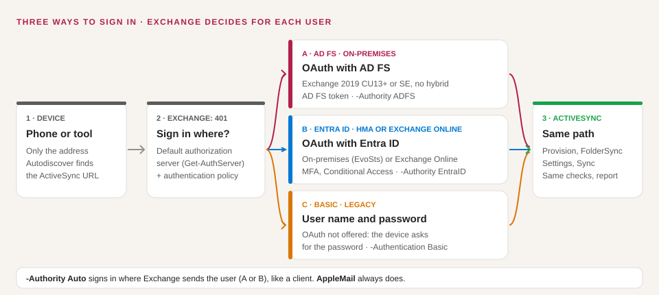

Exchange decides, **for each user**, how a device signs in. A device first sends a request with an empty authorisation header and the address of the user; the `401` of Exchange then names the **authorisation server** — its default one, AD FS or Entra ID (`Get-AuthServer`) — or offers only Basic when the **authentication policy** of the user blocks modern authentication for ActiveSync.

| | AD FS | Entra ID | Basic |
|---|---|---|---|
| **When** | Exchange 2019 CU13+ or SE with AD FS, no hybrid needed | Exchange on-premises with HMA (Hybrid Configuration Wizard run), or a mailbox in Exchange Online | Devices or users without modern authentication (on-premises only) |
| **Exchange names** | AD FS: `issuer_kind="ADFS"` | Entra ID: `issuer_kind="AzureAD"` | No server: `oauth_not_available` |
| **The user signs in** | On the AD FS page | On the Entra ID page: MFA, Conditional Access | On the device, which keeps the password |
| **The tool signs in** | In its sign-in window (5.1) | In its sign-in window (5.1) | With the password asked at start |
| **Exchange receives** | An AD FS token | An Entra ID token | The user name and password, with every request |
| **Tool switch** | `-Authority ADFS` (default) | `-Authority EntraID` | `-Authentication Basic` |
| **Details** | Chapter 6 | Chapter 7 | Chapter 8 |

```cards
search | Which path for this user? | `-TestType Discovery -Mailbox <address>`: the *OAuth for the mailbox* check shows what Exchange offers this user, without signing in.
refresh | Like a client | On the command line, `-Authority Auto` signs in where Exchange sends the user, AD FS or Entra ID. *AppleMail* always does.
compare | Compare two paths | The same scenario with two switches on the same mailbox tells an authentication problem from an ActiveSync one.
```

> [!NOTE]
> **The policy decides what devices are offered.** In the lab (Exchange Server SE 15.2.2562), `BlockModernAuthActiveSync` stopped Exchange from **offering** OAuth to a user — devices then ask for the password — while a token obtained directly from AD FS for this user was still accepted. *OAuth for the mailbox* is therefore the check that predicts what real devices do.

### 5.1 The sign-in window

With OAuth, the tool signs in **like a mail app**: a window opens on the page of AD FS or Entra ID, the account of the test is already typed, the user enters the **password**, then the **MFA** if the server asks for it. The window closes by itself and the test goes on.

```flow
key | Window | AD FS or Entra ID page
arrow | password | MFA, consent
server | Server | authorisation code
arrow | caught | never followed
check | Tool | code + PKCE = token
```

| | Sign-in window (default) | Device code |
|---|---|---|
| **What the user does** | Types the password and the MFA in the window that opens | Opens a page on **any device**, types the code shown, then signs in |
| **Flow** | Authorisation code with PKCE, `prompt=login` | Device code (RFC 8628) |
| **Needs** | A desktop session and Microsoft Edge or Google Chrome | Nothing on the computer that runs the tool |
| **When** | An administration workstation; Conditional Access that blocks the device-code flow | A server without browser, a scheduled task, an SSH session |
| **Switch** | `-SignIn Window` | `-SignIn DeviceCode` |

`-SignIn Auto` (the default, `Test.SignIn`) opens the window when the session can show one and uses the device code otherwise, with a line that says why: no desktop, neither Edge nor Chrome, a policy that forbids the DevTools protocol of the browser (`RemoteDebuggingAllowed = 0`, seen before anything opens: the other browser is tried), or a window that cannot start. The report keeps the reason (*SignInWindow*).

```cards
shield | A clean profile | Edge (or Chrome) starts with a **temporary profile**: no account of the workstation, no cookie, no extension, no single sign-on with the Windows session. The profile is deleted when the window closes.
key | The real flow of the apps | The window replays the **authorisation code** flow of the mail apps. For *AppleMail* it uses the redirect URI of the iPhone (`com.apple.Preferences://oauth-redirect`): the exact path of the iPhone web view.
search | What the tool sees | Only the redirect that carries the code, caught before the browser follows it. The password is typed in the browser and never reaches the tool.
```

> [!TIP]
> **The redirect URIs of the window.** Entra ID returns the code of the Microsoft clients to its native-client page (`https://login.microsoftonline.com/common/oauth2/nativeclient`): nothing to configure. AD FS uses `urn:ietf:wg:oauth:2.0:oob`, registered for the client `d3590ed6-…` by the application group of the Microsoft documentation; if it is missing, `-SignIn Auto` uses the device code and says so.

<!-- icon: key -->
## 6. OAuth with AD FS

Since Exchange Server 2019 CU13 (and Exchange Server SE), ActiveSync clients can sign in with **AD FS**, without hybrid. Exchange names AD FS in its challenge, the device opens the AD FS page, and AD FS issues a token for the Exchange URL.

```flow
server | Exchange 401 | names AD FS
arrow | window | password
key | AD FS | sign-in
arrow | token | aud, scp
mail | ActiveSync | with the token
```

### 6.1 What must be in place

From Microsoft's *Enabling Modern Auth in Exchange on-premises* (AD FS as STS):

| Side | Item | Check |
|---|---|---|
| AD FS | Native client of the tool: `d3590ed6-52b3-4102-aeff-aad2292ab01c` by default (Outlook client of the documented application group), with the redirect URI `urn:ietf:wg:oauth:2.0:oob` for the sign-in window | `Get-AdfsNativeClientApplication -Identifier d3590ed6-52b3-4102-aeff-aad2292ab01c \| Format-List Name, RedirectUri` |
| AD FS | *AppleMail*: client `f8d98a96-0999-43f5-8af3-69971c7bb423` (*iOS and macOS - Native mail application*) with its three redirect URIs | `Get-AdfsNativeClientApplication -Identifier f8d98a96-0999-43f5-8af3-69971c7bb423 \| Format-List Name, RedirectUri` |
| AD FS | Web API whose identifier is **the Exchange URL with the final slash** (`https://mail.contoso.com/`) | `Get-AdfsWebApiApplication \| Format-List Name, Identifier` |
| AD FS | Scopes `openid` and `EAS.AccessAsUser.All` granted to the client; issuance rule `scp` | `Get-AdfsApplicationPermission` |
| Exchange | `OAuth` on the ActiveSync virtual directory | `Get-ActiveSyncVirtualDirectory \| Format-List Server, *auth*` |
| Exchange | AD FS authorisation server, default authorisation endpoint; modern authentication on | `Get-AuthServer \| Format-List Name, Type, IsDefaultAuthorizationEndpoint` · `Get-OrganizationConfig \| Format-List OAuth2ClientProfileEnabled` |
| Exchange | Authentication policy of the user without `BlockModernAuthActiveSync` | `Get-User <user> \| Format-List AuthenticationPolicy` |

> [!NOTE]
> The tool requests the scope `openid https://mail.contoso.com//EAS.AccessAsUser.All`: the **double slash is intentional**. AD FS takes the resource from everything before the last slash, and the Web API identifier ends with `/`.

### 6.2 Run it

```powershell
.\Invoke-EasOAuthMailbox.ps1 -TestType Discovery                     # AD FS metadata, challenge, OAuth for the mailbox
.\Invoke-EasOAuthMailbox.ps1 -TestType Endpoint                      # token issued, then accepted by Exchange
.\Invoke-EasOAuthMailbox.ps1 -TestType Full -AcknowledgePolicy       # the whole path
.\Invoke-EasOAuthMailbox.ps1 -TestType AppleMail -Mailbox eas-test@contoso.com -AcknowledgePolicy
```

The sign-in window opens on the AD FS page, the account already typed: enter its password (and the MFA of AD FS, if any). With `-SignIn DeviceCode`, the page `https://<adfs>/adfs/oauth2/deviceauth` opens instead: enter the displayed code, confirm the client, then sign in.

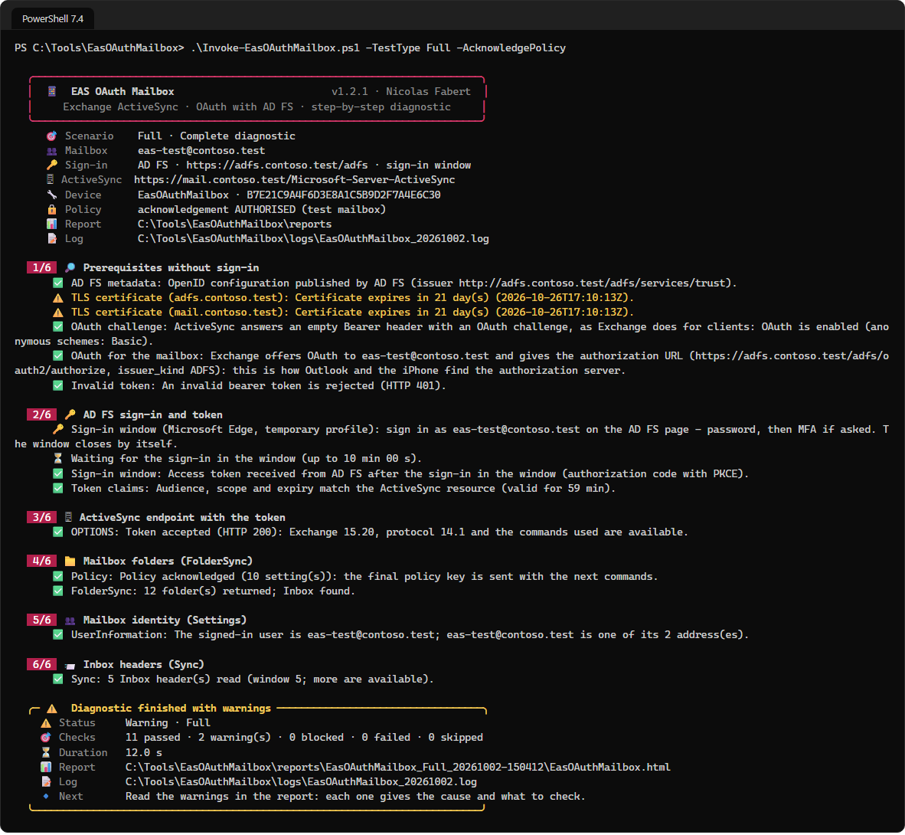

### 6.3 Checks specific to AD FS

| Check | Passed | Warning | Failed |
|---|---|---|---|
| AD FS metadata | `openid-configuration` published | Not readable (endpoint disabled): sign-in can still work | — |
| OAuth challenge · OAuth for the mailbox | Exchange names the configured AD FS | Exchange names **Entra ID**: HMA is enabled (chapter 7) | `oauth_not_available`: the policy of the user blocks modern authentication |
| Token claims | `aud` = Exchange URL with the slash, `scp` contains `EAS.AccessAsUser.All` | Other audience or scope: Exchange will answer 401 | Token expired |
| Apple Mail client in AD FS | Sign-in page shown for the three redirect URIs | A URI other than the Settings one refused (`MSIS9224`) | Client unknown (`MSIS9223`) or Settings URI refused |
| Sign-in window | Code caught, then exchanged for the token | — | `urn:ietf:wg:oauth:2.0:oob` refused (`MSIS9224`) with `-SignIn Window`; window closed; code refused |

> [!TIP]
> After a change of authentication policy, Exchange needs up to 30 minutes (or an `iisreset`) on the front-end servers: a run started too early still shows the old behaviour.

<!-- icon: cloud -->
## 7. OAuth with Entra ID — HMA or Exchange Online

**Entra ID** signs the user in (password, MFA, Conditional Access) and issues the token. The sign-in is **the same** whether the mailbox is on-premises or in Exchange Online; only the ActiveSync URL changes, and with it the token audience and the server that checks the token.

| | Exchange on-premises with HMA | Exchange Online |
|---|---|---|
| **ActiveSync URL** (`-EasUrl`) | The on-premises URL, e.g. `https://mail.contoso.com/Microsoft-Server-ActiveSync` | `https://outlook.office365.com/Microsoft-Server-ActiveSync` |
| **Token for** | The on-premises URL, registered in Entra ID by the Hybrid Configuration Wizard | Exchange Online |
| **Checks the token** | Exchange on-premises, which trusts the tenant (*EvoSts* authorisation server) | Exchange Online, for every tenant (`trusted_issuers="…@*"`) |
| **Basic** | Possible, if the policy of the user allows it | Turned off by Microsoft: refused by the tool |
| **ActiveSync version** | 14.1 (the tool's default) or 16.1 | 16.1 only: the tool switches to it |

```flow
server | Exchange 401 | names Entra ID
arrow | tenant | user realm
cloud | Entra ID | sign-in window
arrow | MFA, CA | token
key | Token | on-prem URL or EXO
arrow | trusted | tenant
mail | ActiveSync | with the token
```

### 7.1 What must be in place

**Both targets**

| Item | Check |
|---|---|
| The user exists in Entra ID (synchronised by Entra Connect, or cloud-only), managed or federated domain | *User realm* check |
| *Microsoft Office* (`d3590ed6-…`, the tool) and *Apple Internet Accounts* (`f8d98a96-…`, the iPhone) are Microsoft applications: nothing to create | User or admin consent for *Apple Internet Accounts* |

**Exchange on-premises with HMA** — from Microsoft's *How to configure Exchange Server on-premises to use Hybrid Modern Authentication*:

| Side | Item | Check |
|---|---|---|
| Entra ID | The on-premises URLs (ActiveSync, Autodiscover) are **service principal names** of *Office 365 Exchange Online* (`00000002-0000-0ff1-ce00-000000000000`) | `Get-MgServicePrincipal -Filter "appId eq '00000002-0000-0ff1-ce00-000000000000'" \| Select-Object -ExpandProperty ServicePrincipalNames` |
| Exchange | *EvoSts* authorisation server, **default authorisation endpoint**; modern authentication on | `Get-AuthServer \| Format-List Name, Type, Enabled, IsDefaultAuthorizationEndpoint` |
| Exchange | Authentication policy of the user without `BlockModernAuthActiveSync` | as in 6.1 |

```powershell
# Enable HMA (Exchange Management Shell), once the Hybrid Configuration Wizard has run
$evo = Get-AuthServer | Where-Object Name -like 'EvoSts*'
Set-AuthServer -Identity $evo.Identity -IsDefaultAuthorizationEndpoint $true
Set-OrganizationConfig -OAuth2ClientProfileEnabled $true
# Back: -IsDefaultAuthorizationEndpoint $false on EvoSts ($true on the AD FS server, if any)
```

**Exchange Online** — a licensed mailbox with ActiveSync enabled (`Get-CASMailbox <user> | Format-List ActiveSyncEnabled`). Nothing else: Exchange Online always sends devices to Entra ID.

### 7.2 Run it

```powershell
# Exchange on-premises with HMA (the ActiveSync URL of the configuration)
.\Invoke-EasOAuthMailbox.ps1 -TestType Discovery -Authority EntraID                     # before and after enabling HMA
.\Invoke-EasOAuthMailbox.ps1 -TestType Full -Authority EntraID -AcknowledgePolicy
.\Invoke-EasOAuthMailbox.ps1 -TestType Endpoint -Authority Auto                         # the server Exchange names

# Exchange Online
$exo = 'https://outlook.office365.com/Microsoft-Server-ActiveSync'
.\Invoke-EasOAuthMailbox.ps1 -TestType Full -Authority EntraID -EasUrl $exo -Mailbox eas-test@contoso.com -AcknowledgePolicy

# Like an iPhone: Autodiscover finds the URL, on-premises or Exchange Online
.\Invoke-EasOAuthMailbox.ps1 -TestType AppleMail -Mailbox eas-test@contoso.com -AcknowledgePolicy
```

The tenant is found from the domain of the mailbox (`-TenantId` otherwise). The sign-in window opens on the Entra ID page: password, then MFA, Conditional Access and consent as for any Microsoft 365 sign-in. In the window, choose the card **OAuth - Entra ID** and type the ActiveSync URL of the target.

In hybrid, the on-premises ActiveSync URL is often open only to Exchange Online addresses: the tool then runs on a server of the organisation. Without a browser there, `-SignIn DeviceCode` shows a code to type at `https://login.microsoft.com/device` **from any device** (in a private window if the browser is already signed in with another account).

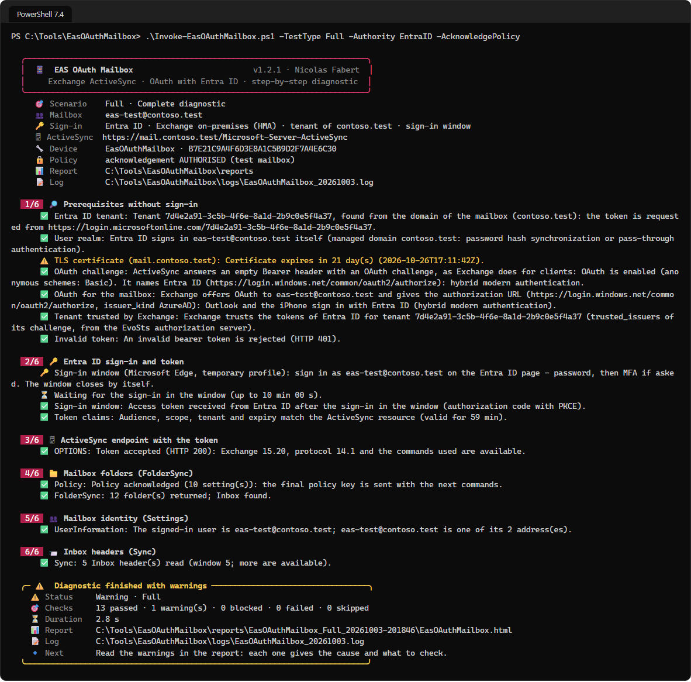

The same scenario against **Exchange Online**: the anonymous request is redirected, the empty `Bearer` gets the Entra ID challenge, every tenant is trusted, and the test goes on in ActiveSync 16.1.

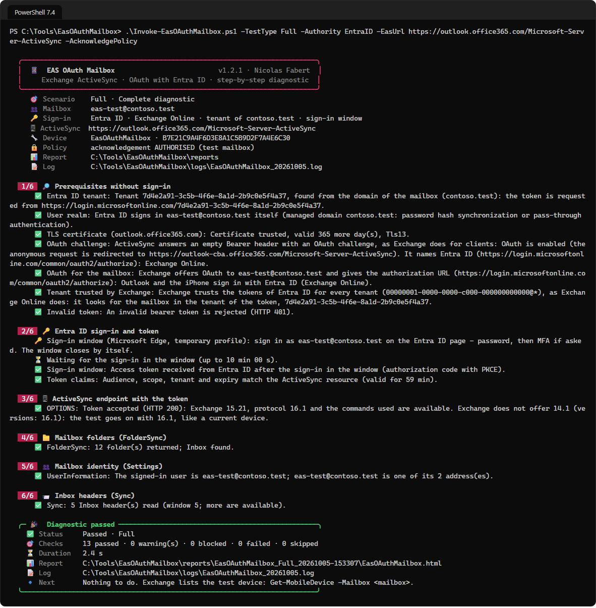

### 7.3 Checks specific to Entra ID

| Check | Passed | Warning | Failed |
|---|---|---|---|
| Entra ID tenant | Tenant ID found | — | Unknown tenant (`AADSTS90002`): set `-TenantId` |
| User realm | Managed or federated domain | Domain unknown to Entra ID: sign in with the UPN | — |
| OAuth challenge · OAuth for the mailbox | Exchange names Entra ID | Exchange names **AD FS**: HMA not enabled | `oauth_not_available` |
| Tenant trusted by Exchange | The tenant is in `trusted_issuers`, or every tenant (`@*`, Exchange Online) | Another tenant only | — |
| Sign-in window · Device-code sign-in | Token received | — | `AADSTS500011` URL not registered (HMA) · `AADSTS65001` / `AADSTS90094` consent · `AADSTS53003` Conditional Access |
| Token claims | Audience = the ActiveSync URL (or Exchange Online), `EAS.AccessAsUser.All`, tenant | Token for Exchange Online sent to an on-premises URL, other tenant, missing scope | Token expired |
| OPTIONS | The token is accepted; with Exchange Online, the test goes on in ActiveSync 16.1 | Neither 14.1 nor 16.1 offered | `401`: token refused |

> [!NOTE]
> **Exchange Online answers an anonymous request with `451`** (redirect to `outlook-cba.office365.com`, certificate-based authentication). This is expected: the *OAuth challenge* check then sends the empty `Authorization: Bearer` header, as the devices do, and Exchange Online answers it with its Entra ID challenge.

> [!IMPORTANT]
> **What the iPhone user sees.** The Mail app signs in with **Apple Internet Accounts**. The first time, Entra ID asks the user to **consent** (*access your mailboxes*); if users cannot consent, the sign-in stops with `AADSTS90094` until an administrator grants it (*Enterprise applications*). MFA and Conditional Access apply as for any Microsoft 365 sign-in.

> [!NOTE]
> **Outlook for iOS and Android does not take this path**: it connects to Exchange Online, which synchronises the mailbox for it (on-premises with HMA). The tool replays the **native** clients (Apple Mail, Android mail apps), which talk to ActiveSync directly with the Entra ID token.

### 7.4 A mailbox moved to Exchange Online

In hybrid, Exchange on-premises answers the devices of a mailbox **moved** to Exchange Online with **HTTP 451** and `X-MS-Location` = the Exchange Online URL: the device then goes there and signs in with Entra ID. The tool reports this redirect (Warning or Failed, depending on the check) and gives the command to run next:

```powershell
$exo = 'https://outlook.office365.com/Microsoft-Server-ActiveSync'
.\Invoke-EasOAuthMailbox.ps1 -TestType Full -Authority EntraID -EasUrl $exo -Mailbox <moved user> -AcknowledgePolicy
```

<!-- icon: user -->
## 8. Basic authentication

The device sends the **user name and password** in the `Authorization: Basic` header of **every** request, protected only by TLS: no AD FS, no Entra ID, no token. Use it to compare both paths on the same server, to validate the mailboxes that still use Basic, or to see what an iPhone does when Exchange does not offer OAuth to the user.

```flow
search | Discovery | Basic offered
arrow | password | Basic header
key | Basic sign-in | OPTIONS
arrow | same header | each request
mail | ActiveSync | Settings, Sync
```

### 8.1 What must be in place

| Side | Item | Check |
|---|---|---|
| Exchange | Basic on the ActiveSync virtual directory | `Get-ActiveSyncVirtualDirectory \| Format-List Server, BasicAuthEnabled` |
| Exchange | Authentication policy of the user without `BlockLegacyAuthActiveSync` | `Get-User <user> \| Format-List AuthenticationPolicy` · `Get-AuthenticationPolicy \| Format-List Name, BlockLegacyAuthActiveSync` |
| Publishing | The reverse proxy lets `Basic` through (no pre-authentication) | *Basic challenge* check |
| Account | The password of the test user; its UPN or `DOMAIN\user` if it differs from the address | `-Credential` or `Target.BasicUser` |

### 8.2 Run it

```powershell
.\Invoke-EasOAuthMailbox.ps1 -TestType Discovery -Authentication Basic -Mailbox legacy@contoso.com   # no password needed
.\Invoke-EasOAuthMailbox.ps1 -TestType Full -Authentication Basic -Mailbox legacy@contoso.com -AcknowledgePolicy
.\Invoke-EasOAuthMailbox.ps1 -TestType AppleMail -Authentication Basic -Mailbox legacy@contoso.com -AcknowledgePolicy
.\Invoke-EasOAuthMailbox.ps1 -TestType Endpoint -Authentication Basic -Credential (Get-Credential)
```

The password is asked at start (or typed in the window) and stays in memory. The trace keeps only the user name: `Authorization: Basic <user eas-test@contoso.com, password never written>`.

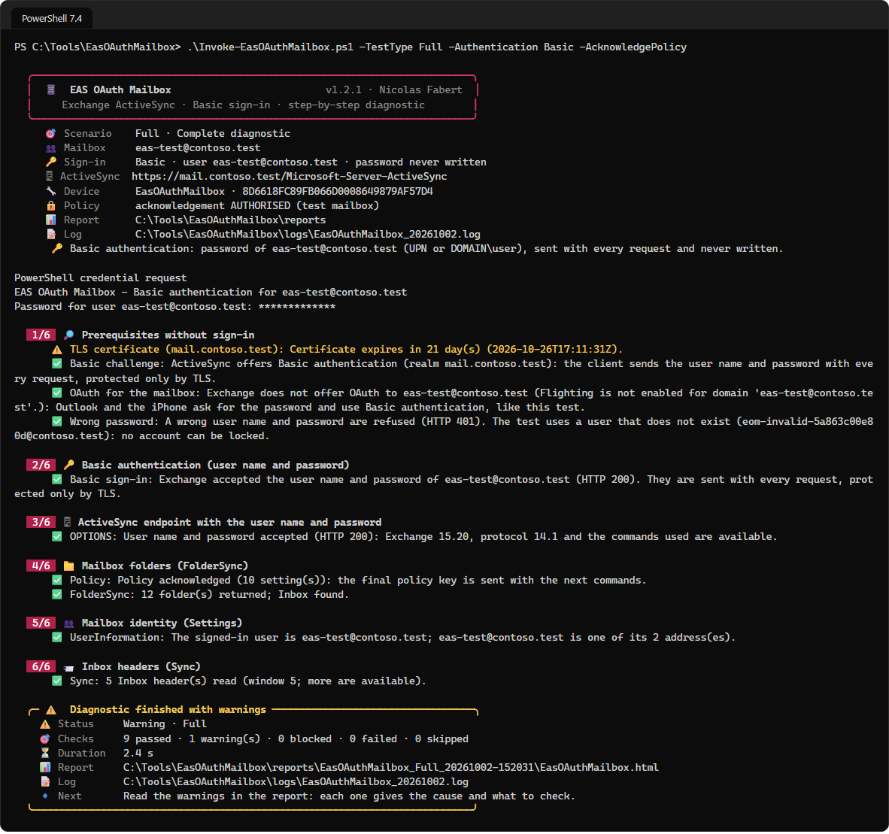

### 8.3 Checks specific to Basic

| Check | Passed | Warning | Failed |
|---|---|---|---|
| Basic challenge | `401` with `WWW-Authenticate: Basic realm="…"` | `451` redirect, anonymous `200`, another code (HTTP 500 while Exchange starts): the *Basic sign-in* decides | No `Basic`: disabled on the virtual directory or stopped by the reverse proxy |
| OAuth for the mailbox | Exchange **does not** offer OAuth to the user: devices ask for the password, like the test | Exchange offers OAuth: Outlook and the iPhone will not use the password — run without `-Authentication Basic` | `451` redirect or no `401` |
| Wrong password | A wrong user name and password are refused (`401`) | Other code | **Accepted**: check the publishing chain now |
| Basic sign-in | `200` | — | `401` password, account, Basic or policy · `403` ActiveSync disabled, device rule |

> [!IMPORTANT]
> **A wrong password is sent only once.** *Basic sign-in* stops the run at the first refusal: nothing more is sent with the same credentials, which protects the account from lockout (AD lockout, AD FS Extranet Lockout). The *Wrong password* check uses a user that **does not exist** (`eom-invalid-<random>@<domain>`).

With Basic, the report shows the authentication in its title, the user name sent in the *Signed-in user* card and *Not used* in the *AD FS* card.

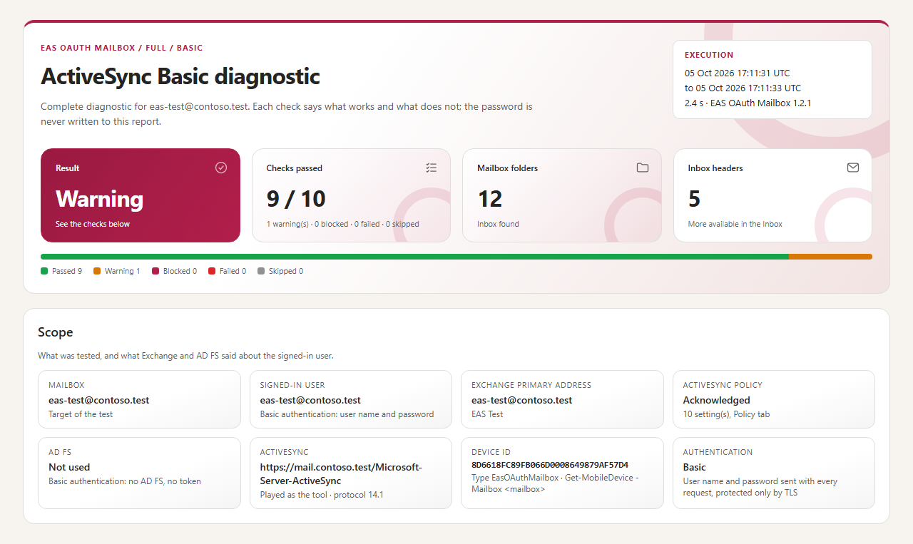

# Part III · Set up

<!-- icon: checklist -->
## 9. Prerequisites

| Item | Requirement |
|---|---|
| Workstation | Windows 10 / 11 or Windows Server 2016 to 2025 (9.1), **PowerShell 7.4 or later** (`pwsh`). No module to install. The window (`-Gui`) uses WPF: Fluent theme of Windows 11 with PowerShell 7.5 or later. **Microsoft Edge** or **Google Chrome** for the sign-in window (5.1); without them, a device code typed on any device. |
| Network | HTTPS (443) to the ActiveSync URL and to AD FS or `login.microsoftonline.com`, through the system proxy if needed. The direct TLS check of *Discovery* needs a direct TCP connection (otherwise a warning). |
| Exchange | Exchange Server 2019 **CU13 or later**, or Exchange Server SE. |
| Path | AD FS (6.1), Entra ID (7.1) or Basic (8.1). |
| Account | A **test mailbox** whose authentication policy allows the path tested. |
| Development | Pester 6.1 or later, only for `Run-Tests.ps1`. |

### 9.1 Windows versions

The same package runs from Windows Server 2016 to 2025 and on Windows 10 and 11. What changes is the browser for the sign-in window and the look of the window `-Gui`.

| Windows | Sign-in window | Window `-Gui` | Tested |
|---|---|---|---|
| Server 2025, Windows 11 | Edge in the box | Fluent, Windows 11 icons | ✔ |
| Server 2022 | Edge in the box | Fluent, *Segoe MDL2* icons | ✔ |
| Server 2019 | Edge if installed (present on recent images) | Fluent, *Segoe MDL2* icons | ✔ |
| Server 2016 | **Install Edge** — otherwise the device code | Fluent, *Segoe MDL2* icons | ✔ |
| Server Core (any version) | No desktop: the device code | Not available: command line | — |

*Fluent* needs PowerShell 7.5 or later; with 7.4 the window keeps the same layout with classic controls (tested on 2016, 2019 and 2022). Windows before Windows 11 and Server 2025 has no *Segoe Fluent Icons* font: the window uses *Segoe MDL2 Assets*, which has the same glyphs. Windows Server 2016 has no light or dark setting: the window is light.

> [!TIP]
> **Install PowerShell 7 on a server with the MSI** (`PowerShell-7.x-win-x64.msi`), not with `winget`, which installs the Store package from 7.6. Without installation rights, the ZIP works too: unzip it and run `pwsh.exe`.

<!-- icon: download -->
## 10. Installation

> [!IMPORTANT]
> Files downloaded from the Internet may be blocked by Windows and fail to run. Before using this project, unblock every file in the downloaded folder:
>
> ```powershell
> Get-ChildItem "C:\Chemin\Du\Dossier" -Recurse -File -Force | Unblock-File
> ```
>
> Replace the example path with the folder where you downloaded or extracted this project.

```steps
Copy the package | Copy the `EasOAuthMailbox-1.2.1` folder, for example to `C:\Tools\EasOAuthMailbox`. No installer, no module to register.
Check PowerShell | `pwsh -NoProfile -Command '$PSVersionTable.PSVersion'` shows 7.4 or later.
Configure | Edit `config\EasOAuthMailbox.config.psd1` (chapter 11): every error is listed at once on start.
First tests | `-TestType Discovery` (no account), then `-TestType Endpoint` (sign-in), then `-TestType Full -AcknowledgePolicy` on the test mailbox.
```

The package contains no tests, reports, logs or run data.

<!-- icon: settings -->
## 11. Configuration

`config\EasOAuthMailbox.config.psd1` is a PowerShell data file in sections; relative paths start from the tool folder. An unknown key is rejected and every error is listed together. The command line overrides the main values (chapter 12); `-ConfigPath` selects another file, for example one per site or per lab.

```powershell
@{
    Target  = @{ AdfsUrl = 'https://adfs.contoso.com/adfs'; EasUrl = 'https://mail.contoso.com/Microsoft-Server-ActiveSync'
                 Mailbox = 'eas-test@contoso.com'; ClientId = 'd3590ed6-52b3-4102-aeff-aad2292ab01c'; BasicUser = ''
                 Authority = 'ADFS'; TenantId = '' }
    Device  = @{ DeviceId = ''; DeviceType = 'EasOAuthMailbox'; UserAgent = 'EasOAuthMailbox/1.0' }
    Test    = @{ DefaultType = 'Full'; Authentication = 'OAuth'; MessageCount = 5; AcknowledgePolicy = $false
                 OAuthPollTimeoutSeconds = 600; HttpTimeoutSeconds = 60; CertificateWarningDays = 30 }
    Report  = @{ OutputPath = '.\reports'; FilePrefix = 'EasOAuthMailbox'; Formats = @('Csv', 'Html'); CsvDelimiter = ';' }
    Logging = @{ Path = '.\logs'; RetentionDays = 14 }
    AppleMail = @{ ClientId = 'f8d98a96-0999-43f5-8af3-69971c7bb423'; UserAgent = 'Apple-iPhone15C4/2401.539000006'; DeviceType = 'iPhone' }
}
```

| Key | Default | Role |
|---|---|---|
| `Target.EasUrl` | — | ActiveSync URL published to the devices. *AppleMail* finds it by Autodiscover and uses this value only as a fallback. |
| `Target.Mailbox` | — | Test mailbox (SMTP or UPN). |
| `Target.Authority` | `ADFS` | `ADFS`, `EntraID` or `Auto` (the server Exchange names). |
| `Target.AdfsUrl` | — | AD FS root, ends with `/adfs`. Only with `Authority = 'ADFS'`. |
| `Target.TenantId` | empty | Entra ID: tenant ID or domain. Empty: the domain of the mailbox. |
| `Target.ClientId` | `d3590ed6-…` | Client used to sign in (AD FS application, or *Microsoft Office* in Entra ID). Not used by Basic. |
| `Target.BasicUser` | empty | Basic: UPN or `DOMAIN\user`. Empty: the mailbox. |
| `Test.Authentication` | `OAuth` | `OAuth` or `Basic`. |
| `Test.SignIn` | `Auto` | OAuth sign-in: `Window` (sign-in window), `DeviceCode` (a code typed on any device) or `Auto` (the window when the session can show one) — 5.1. |
| `Test.DefaultType` | `Full` | Scenario when `-TestType` is not given. |
| `Test.AcknowledgePolicy` | `$false` | Allows the ActiveSync policy to be acknowledged. Test mailbox only. |
| `Test.MessageCount` | 5 | Headers read by *InboxSync* (1 to 100). |
| `Test.OAuthPollTimeoutSeconds` · `HttpTimeoutSeconds` | 600 · 60 | Longest wait for the sign-in · timeout of each request. |
| `Test.CertificateWarningDays` | 30 | *Discovery*: warning when a certificate expires sooner. |
| `Device.DeviceId` · `DeviceType` · `UserAgent` | stable · `EasOAuthMailbox` · `EasOAuthMailbox/1.0` | The device seen by Exchange. An empty ID is derived from the workstation, mailbox and type. |
| `Report.*` | `.\reports` · `EasOAuthMailbox` · `Csv`, `Html` · `;` | Folder, prefix, formats (`Summary.json` is always written), CSV delimiter (`;` opens in a French Excel). |
| `Logging.Path` · `RetentionDays` | `.\logs` · 14 | Daily log and its retention. |
| `AppleMail.*` | `f8d98a96-…` · `Apple-iPhone15C4/…` · `iPhone` | Client, User-Agent (iPhone 15, iOS 27) and device type of *AppleMail*: a distinct device in `Get-MobileDevice`. |

> [!CAUTION]
> **No secret in this file.** The OAuth sign-in is interactive and the token stays in memory. The Basic password is asked at each run and never saved. The delivered file holds only `contoso.test` sample values.

# Part IV · Use

<!-- icon: terminal -->
## 12. Command line

```powershell
.\Invoke-EasOAuthMailbox.ps1 -TestType Discovery                  # prerequisites, no sign-in
.\Invoke-EasOAuthMailbox.ps1 -TestType Full -AcknowledgePolicy    # acceptance test of the test mailbox
.\Invoke-EasOAuthMailbox.ps1 -TestType InboxSync -Mailbox eas-test2@contoso.com -MessageCount 20 -OutputPath D:\Diag
.\Invoke-EasOAuthMailbox.ps1 -TestType Full -ConfigPath .\config\site-b.config.psd1
.\Invoke-EasOAuthMailbox.ps1 -Gui                                  # the window
```

The commands of each path are in chapters 6.2, 7.2 and 8.2.

| Parameter | Role |
|---|---|
| `-TestType` | `Discovery`, `OAuth`, `Endpoint`, `FolderSync`, `Provisioning`, `Identity`, `InboxSync`, `Full` or `AppleMail`. |
| `-Authority` · `-TenantId` | `ADFS` (default), `EntraID` or `Auto` · the Entra ID tenant. |
| `-SignIn` | `Auto` (default), `Window` or `DeviceCode` (5.1). |
| `-Authentication` · `-Credential` | `OAuth` (default) or `Basic` · the Basic user name and password (asked otherwise). |
| `-AcknowledgePolicy` | Allows the ActiveSync policy to be acknowledged (test mailbox). |
| `-AdfsUrl` `-EasUrl` `-Mailbox` `-DeviceId` `-MessageCount` `-OutputPath` `-ConfigPath` | Override the configuration for one run. |
| `-NoReport` | Console and log only. |
| `-AccessToken` | A token already obtained (integration); it can remain in the PowerShell history, which the tool reports. |

| Exit code | Status |
|---:|---|
| `0` | Passed |
| `1` | Failed, or invalid configuration |
| `2` | Warning, or Blocked (acknowledgement not authorised) |

The console follows the same rules as the other tools: a title card, one numbered stage per phase, one line per check, a final card with the status, first problem, report, log and next action. Colours disappear when the output is redirected (`NO_COLOR`); icons adapt to the terminal (`EOM_ICONS = Emoji | Symbols | Ascii`).

<!-- icon: people -->
## 13. Window

`.\Invoke-EasOAuthMailbox.ps1 -Gui` opens the window. It runs **the same engine** and writes the same report.


```cards
key | Sign-in method | Three cards: *OAuth - On-prem AD FS*, *OAuth - Entra ID* (HMA or Exchange Online: the ActiveSync URL decides), *Basic - On-prem* — the paths of chapter 5. `-Authority Auto` stays on the command line.
target | Target | The mailbox and the ActiveSync URL; the AD FS URL only for AD FS, the user name and password only for Basic. *Client and device*: client ID, device ID, headers.
layers | Scenario | The nine scenarios, their description and a notice that says what the run creates. The policy checkbox, and **Sign in with a device code** instead of the sign-in window (5.1).
chart | Progress | One line per check with the icon of its status, as in the report; a **device code** shows in its own box with **Copy** and **Open the page**.
```

**Run the test** checks every value first (errors in *Progress*, nothing sent), then runs; **Cancel** stops at the next check. **Open the report** and **Open the folder** after a run. **Close** or **Esc** closes the window, except during a test. Nothing is saved, the password never.

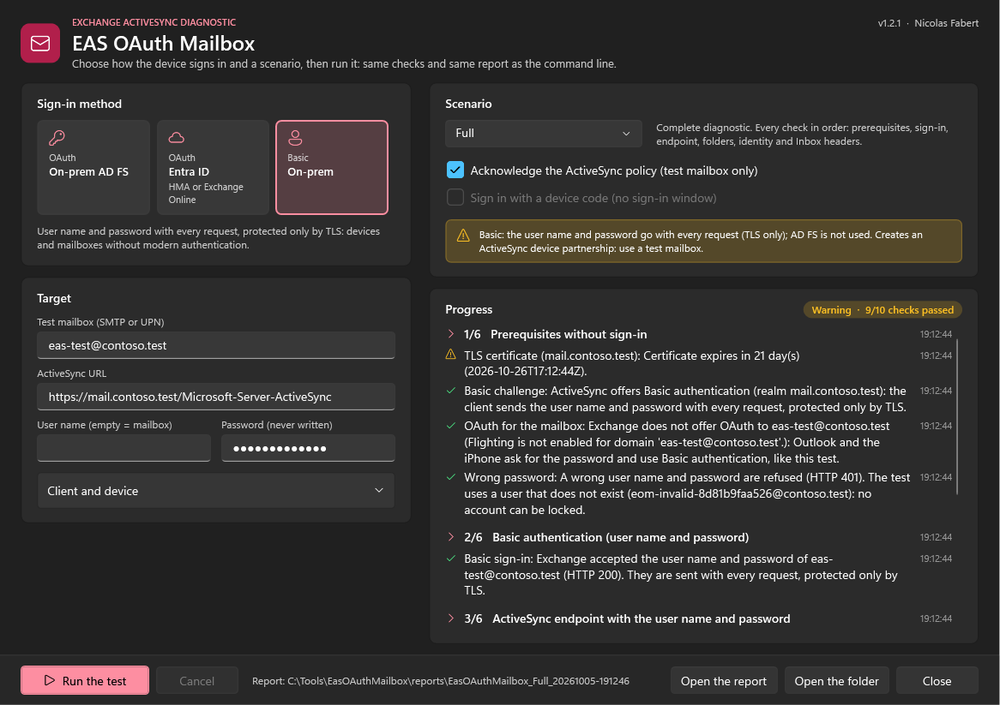

> [!NOTE]
> The window uses **WPF**. With PowerShell 7.5 or later (.NET 9+) it takes the **Fluent theme of Windows 11**, light or dark like Windows, with the accent colour of the report; with PowerShell 7.4 it keeps the same layout with the classic controls (Windows versions: 9.1). It follows Windows scaling and stays within the screen, down to 1024 × 768. While it is open, the console that started it ignores **Ctrl+C** (otherwise PowerShell would stop the window).

<!-- icon: search -->
## 14. The checks in detail

### 14.1 Discovery — no sign-in

| Check | Request | Passed | Warning | Failed |
|---|---|---|---|---|
| AD FS metadata · Entra ID tenant · User realm | `openid-configuration`, user realm | Server found (chapters 6.3, 7.3) | Not readable · unknown domain | Unknown tenant |
| TLS certificate | Direct TLS connection | Trusted, expiry beyond `CertificateWarningDays` | No direct connection (proxy), close expiry | Not trusted by the workstation; handshake interrupted before the certificate (network) |
| OAuth challenge | Anonymous `OPTIONS`, then empty `Authorization: Bearer` | `401` with `WWW-Authenticate: Bearer`, naming the expected server | No `Bearer` challenge, **another** server, `451`, anonymous `200`, another code (HTTP 500 while Exchange starts): *OAuth for the mailbox* and the sign-in decide | — |
| OAuth for the mailbox | Same, with `X-User-Identity` = the mailbox | The expected server is named for the mailbox | Another server; no URL; `451` | `oauth_not_available`: policy or domain |
| Tenant trusted by Exchange | (from the challenge) | Tenant in `trusted_issuers`, or every tenant (`@*`, Exchange Online) | Another tenant only | — |
| Basic challenge · Wrong password | Basic only (chapter 8.3) | | | |
| Invalid token | `OPTIONS` with a forged token | Refused (`401`) | Other code | **Accepted**: check the publishing chain now |

> [!NOTE]
> Exchange Server 2019 CU13+ and SE answer an anonymous request with `Basic` only: the `Bearer` challenge comes back to a request that carries an **empty** `Authorization: Bearer` header, as a client sends to discover OAuth. The accompanying `x-ms-diagnostics` (*Flighting is not enabled*) also appears in a working environment: alone, it is not a fault. The *Discovery* checks are independent: a failure does not stop the others.

### 14.2 Sign-in and token

In the **sign-in window** (5.1), the tool asks for an authorisation code with PKCE (`code_challenge_method=S256`), the account of the test as `login_hint` and `prompt=login`. It catches the redirect that carries the code, checks the `state`, then exchanges the code and the PKCE verifier for the token. With the **device code**, it requests a code, opens the verification page and shows the code, then polls until the sign-in, the expiry of the code or `OAuthPollTimeoutSeconds`.

**Token claims** reads the token without checking its signature (the role of Exchange):

| Claim | Expected | Otherwise |
|---|---|---|
| `aud` | The Exchange URL: with the final slash for AD FS, without for Entra ID | Warning: Exchange will answer 401 |
| `scp` | Contains `EAS.AccessAsUser.All` | Warning: missing rule or permission |
| `exp` | In the future | **Failed** |
| `upn` · `tid` | Informational · the tenant (Entra ID) | The *Identity* check decides |

### 14.3 Endpoint

`OPTIONS` with the token or the password. A refusal gives the HTTP code and the reason sent by Exchange in `x-ms-diagnostics` (for example *The token has an invalid audience*). Success gives the Exchange version, the protocols (14.1, or 16.1 for *AppleMail*) and the commands; a missing command is a warning. When 14.1 is not offered but 16.1 is — Exchange Online offers only 16.1 — the test goes on in 16.1, like a current device.

### 14.4 ActiveSync policy and FolderSync

```flow
folder | FolderSync | key 0
arrow | 449 · 142 | provisioning required
shield | Provision | download
arrow | authorised? | AcknowledgePolicy
check | Acknowledgement | final key
arrow | same key | retry
folder | FolderSync | folders, Inbox
```

The final policy key is reused by every following command. The *Provisioning* scenario downloads the policy even when Exchange does not require it. A `FolderSync` without Inbox (type 2) is a warning, and *InboxSync* will fail.

### 14.5 Identity and InboxSync

- **Identity**: `Settings` › `UserInformation` returns the addresses of the user **associated with the credentials**. Passed if the tested mailbox is one of them; otherwise Warning — the folders read are those of that user.
- **InboxSync**: initial `Sync`, then up to `MessageCount` items — date, sender, subject, read. No body, no attachment.

### 14.6 AppleMail — the iPhone path

The scenario replays what an iPhone does when the user adds an Exchange account (*Settings › Mail › Accounts › Add Account › Microsoft Exchange*). The sequence comes from a real iPhone 15 (iOS 27) recorded in the lab, in the Exchange IIS and HttpProxy logs and the AD FS audit:

```flow
search | Autodiscover | ActiveSync URL
arrow | empty header | + identity
server | Exchange 401 | names the server
arrow | web view | Apple client
key | Sign-in page | password
arrow | code | token
mail | ActiveSync 16.1 | as an iPhone
```

| Moment | What the iPhone does | What the tool replays |
|---|---|---|
| 1 | Autodiscover v2 on `autodiscover.<domain>` | Same: *Autodiscover*. The URL found is used for the rest. |
| 2 | Request with an empty `Authorization` header and the address: Exchange names the server | Same: *OAuth for the mailbox*. The server found is used for the rest. |
| 3 | Opens the sign-in page of the Apple client (`/adfs/oauth2/authorize` or Entra ID) | Same request, **without a password**: *Apple Mail client in AD FS* (three redirect URIs), or the Entra ID page. |
| 4 | Password, authorisation code to `com.apple.Preferences://oauth-redirect`, token | Same in the **sign-in window**: the Apple client, the same redirect URI, the code caught then exchanged. With `-SignIn DeviceCode`: device code of the same Apple client. |
| 5 | `OPTIONS`, `FolderSync`, `Provision` ×2, `Settings`, `Sync`, `Ping` with protocol **16.1**, `DeviceType=iPhone` | Same up to `Sync`, same policy and key. |

> [!IMPORTANT]
> **Moment 2 is the one that most often fails.** Exchange names the server only if the authentication policy of the user allows modern authentication for ActiveSync. Otherwise it answers `oauth_not_available` and the iPhone **asks for a password** instead of opening the sign-in page. With `-Authentication Basic`, *AppleMail* checks precisely that, then continues with the password (chapter 8).

**Only the address is needed**, as on the iPhone: `-TestType AppleMail -Mailbox <address>`. `Target.AdfsUrl` and `Target.ClientId` are not used; `-EasUrl` only if Autodiscover does not answer. The *Scope* block of the report says where each URL comes from.

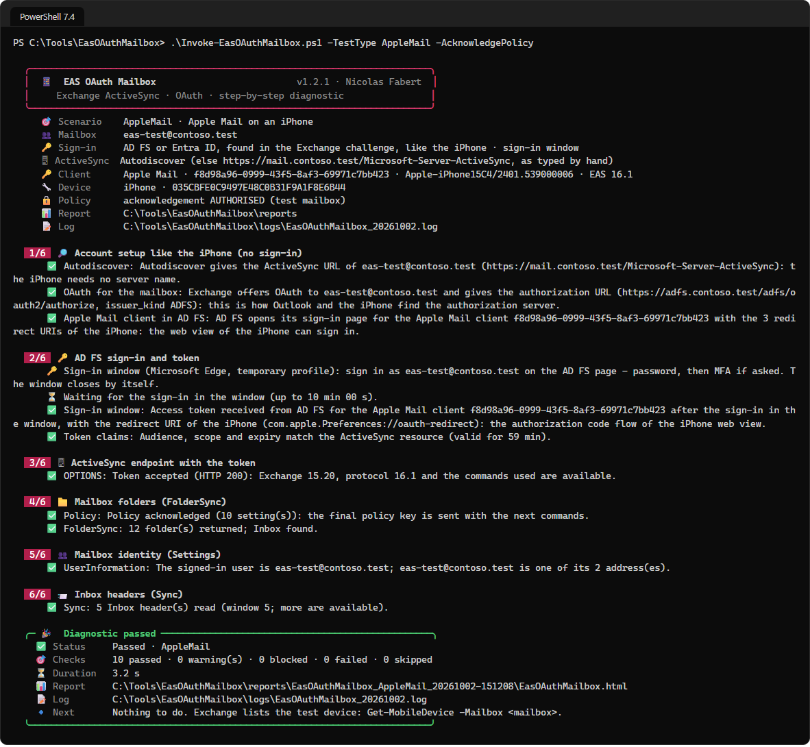

The request of moment 3 with AD FS, as recorded in the AD FS audit:

```text
GET https://<adfs>/adfs/oauth2/authorize
    ?response_type=code
    &client_id=f8d98a96-0999-43f5-8af3-69971c7bb423
    &redirect_uri=com.apple.Preferences://oauth-redirect
    &resource=https://<exchange>/
    &display=ios  &ui_locales=fr-fr  &state=<GUID>
    &claims={"access_token":{"xms_cc":{"values":["cp1"]}}}
    &login_hint=<address>
```

> [!WARNING]
> **An “iPhone” appears in Exchange**: type `iPhone`, friendly name `iPhone (EAS OAuth Mailbox <computer>)`, distinct from the `EasOAuthMailbox` device. A device access rule that targets iPhones applies to it. To remove it: `Get-MobileDevice -Mailbox <mailbox> | Where-Object FriendlyName -like 'iPhone (EAS OAuth Mailbox*' | Remove-MobileDevice`. The `AppleMail` section of the configuration can reproduce the exact model of a user (`Get-MobileDevice | Format-List DeviceUserAgent, DeviceModel`).

<!-- icon: chart -->
## 15. Reading the report

The HTML report is self-contained (no external resource), follows the light or dark theme of the system and shares the visual system of Purview DLP Report and Exchange Log Report.

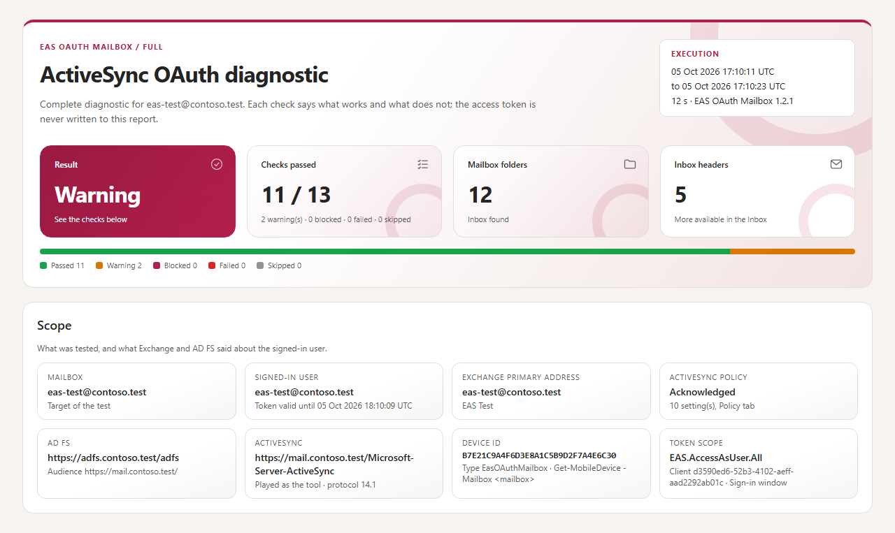

- **Header**: scenario, mailbox, period; tiles for the result (and first problem), checks, folders, headers; the status bar.
- **Scope**: mailbox, signed-in user, address seen by Exchange, policy, authorisation server (AD FS, Entra ID or *Not used*), ActiveSync URL, device, scope and client of the token.

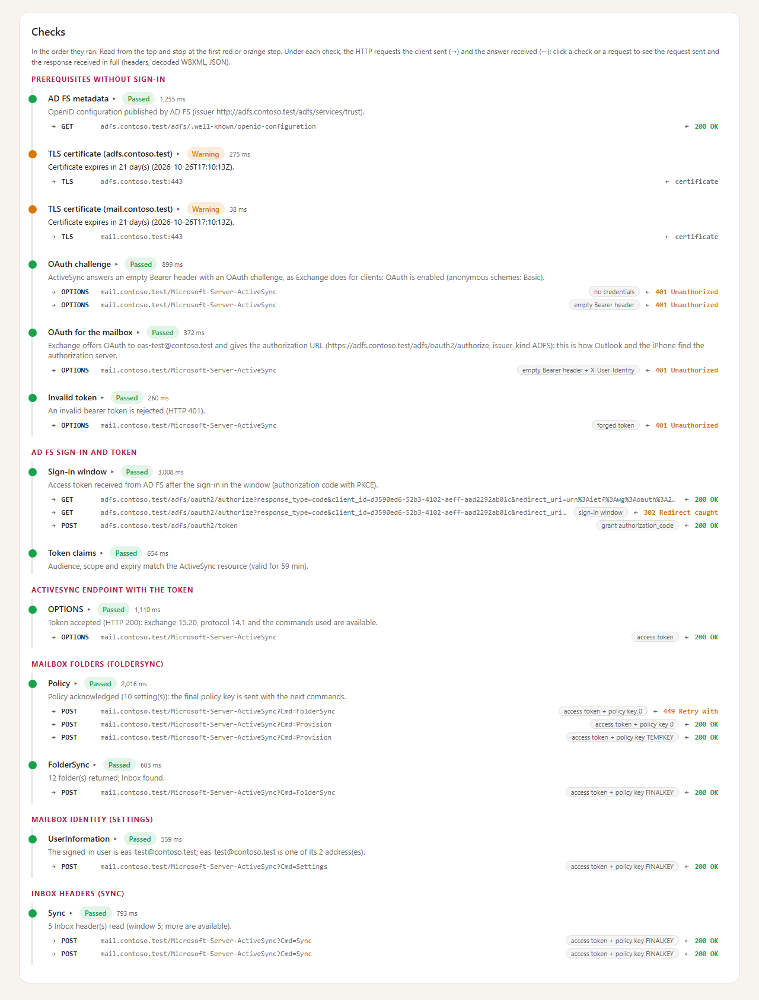

- **Checks**: in run order, grouped by stage, with their duration; a box at the top repeats the first *Failed* or *Blocked* one. **Read from the top and stop at the first red or orange item.** Under each check, one line per HTTP request: what was sent (*no credentials*, *empty Bearer header* + *X-User-Identity*, *access token*, *user name and password (Basic)*, policy key...) and the response.
- **Detail**: click a check for everything kept — HTTP code, `x-ms-diagnostics`, certificate, token claims — then its HTTP exchanges.
- **Tabs**: *All checks*, *Folders*, *Inbox headers*, *Policy*, *HTTP trace*; search, sort, and **Export view to CSV**.

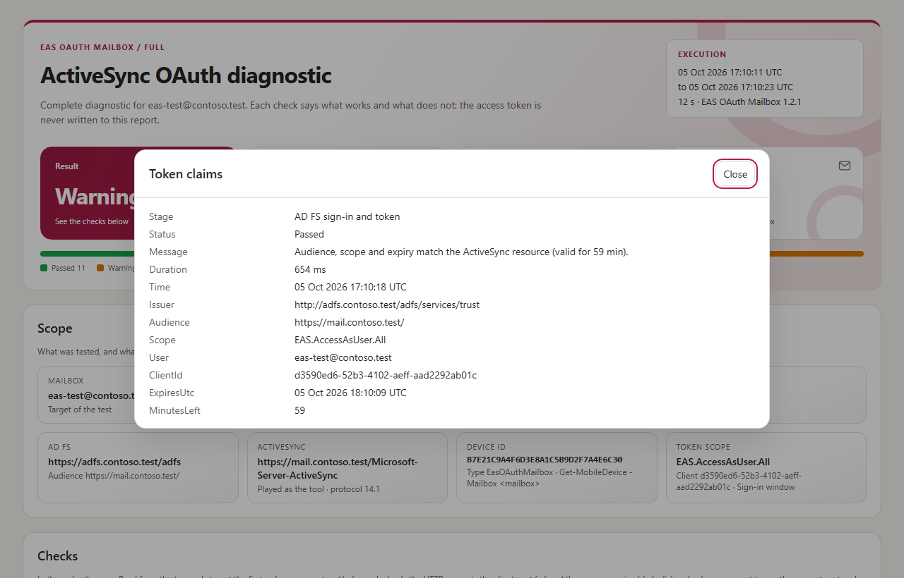

### 15.1 The HTTP trace

Every request of the tool (ActiveSync, Autodiscover, AD FS, Entra ID) is kept with its response and attached to the check that sent it. The sign-in window has one line, *sign-in window*: the page it opened and the redirect it caught, code masked — the pages of the sign-in are exchanged by the browser. Click a line to see the **request sent** and the **response received** side by side: start line, all headers in order, the **WBXML decoded as XML**, form fields and JSON indented, HTML pages summarised, and for certificate checks the name requested and the certificate presented.


> [!IMPORTANT]
> **No secret in the trace.** Tokens, device code, authorisation code and cookies are replaced by their length (`Bearer <access token: 1234 characters, never written>`); for Basic only the user name is kept. Only the forged token of *Invalid token* appears in full: it is not a secret. Mailbox data (folders, addresses, subjects) appears as in the rest of the report.

> [!TIP]
> The identical polls of the sign-in wait (`400 authorization_pending`, every 5 seconds) are grouped into one line marked `×N`. The **Copy** button copies a request or a response, for example for a ticket.

<!-- icon: file -->
## 16. Files produced

Each run creates `<FilePrefix>_<Scenario>_<yyyyMMdd-HHmmss>` under `Report.OutputPath`:

| File | Content |
|---|---|
| `…-Steps.csv` | One check per line: stage, name, status, message, details, duration, time, HTTP exchanges. |
| `…-Folders.csv` · `…-Messages.csv` · `…-Policy.csv` | Folders · Inbox headers · ActiveSync policy returned by Exchange. |
| `…-Trace.csv` | One HTTP exchange per line, full request and response, secrets masked. |
| `…-Summary.json` | The full result, for a script. |
| `….html` | The self-contained report. |
| `logs\EasOAuthMailbox_yyyyMMdd.log` | The console lines of the day, plus one line per HTTP request. |

> [!IMPORTANT]
> CSV files are UTF-8 with BOM. A cell that starts with `=`, `+`, `-` or `@` (a message subject, for example) gets an apostrophe in front, so that Excel does not run it as a formula. Reports contain addresses and subjects: protect them as messaging data.

# Part V · Maintain

<!-- icon: gear -->
## 17. Architecture

| File | Role |
|---|---|
| `Invoke-EasOAuthMailbox.ps1` | Entry point: configuration, overrides, log, banner, run, report, final card, exit code. |
| `EasOAuthMailbox.psd1` · `.psm1` | Manifest and loader of the module. |
| `src\EasOAuthMailbox.Config.ps1` | Configuration, scenarios and stages, endpoints. |
| `src\EasOAuthMailbox.Http.ps1` | Every HTTP request goes through `Invoke-EomHttp`: the send (`Send-EomHttpRequest`, the only contact with the network) and the trace (secrets masked, WBXML decoded). |
| `src\EasOAuthMailbox.Core.ps1` | ActiveSync protocol: WBXML, `Provision`, `FolderSync`, `Settings`, `Sync`. |
| `src\EasOAuthMailbox.Checks.ps1` | Sign-in (AD FS, Entra ID, Basic), claims, one function per stage, orchestration. |
| `src\EasOAuthMailbox.Browser.ps1` | The sign-in window: Edge or Chrome with a temporary profile, driven through its DevTools protocol on the loopback interface. |
| `src\EasOAuthMailbox.Report.ps1` · `Console.ps1` · `Gui.ps1` | CSV, JSON and HTML · console and log · WPF window (XAML, Fluent theme). |
| `templates\Report.template.html` | The report: text, colours and tabs can change without touching the code. |

The token is never placed in the result and the trace keeps only its length; the Basic password (`pscredential`) stays in the context of the run and only the user name reaches the result and the trace.

<!-- icon: beaker -->
## 18. Tests

```powershell
.\Run-Tests.ps1
```

The tests use neither AD FS, Entra ID nor Exchange: `tests\EasOAuthMailbox.Simulator.ps1` simulates them by replacing the only contact point with the network (`Send-EomHttpRequest`). Everything else is the real code. ActiveSync answers are **WBXML documents built byte by byte**, with the real Exchange HTTP codes and headers.

```cards
settings | Configuration | Sections, unknown keys, paths, scenarios, device ID, requirements of each path.
layers | Protocol | WBXML integers and strings, truncated documents, exact requests, statuses, provisioning, remote wipe.
key | AD FS | Challenge, other server, forged token accepted, OAuth blocked for a mailbox, claims.
search | Sign-in window | PKCE and state, code exchanged once, redirect caught for AD FS, Entra ID and the iPhone, fallback to the device code, window closed, consent declined.
cloud | Entra ID | Tenant, realm, trusted issuers, device code v2.0, another tenant, `AADSTS` errors, `Auto`.
user | Basic | Header in UTF-8, password never written, no AD FS request, a wrong password sent once.
phone | AppleMail | iPhone User-Agent and type, Apple client page, `MSIS9223` / `MSIS9224`, Entra ID and Basic variants.
file | Report and window | Files, trace, formula protection; window: layout, Fluent theme and accent, the three methods, status icons, device code box, validation, closing.
```

Each fault fixed during tuning has its own test: bringing the fault back makes this test fail, and only this one.

<!-- icon: wrench -->
## 19. Evolving the tool

| Evolution | Where |
|---|---|
| A new check | `src\EasOAuthMailbox.Checks.ps1`, function `Invoke-EomStage<Stage>` (one `Add-EomStep` per check), then a test with the simulator. |
| A new scenario | `$script:Scenarios` in `src\EasOAuthMailbox.Config.ps1`, and the `ValidateSet` of `Invoke-EasOAuthMailbox.ps1` and `Invoke-EomMailboxTest`. |
| A new ActiveSync command | `src\EasOAuthMailbox.Core.ps1`, then its answer in the simulator. |
| Report | `templates\Report.template.html`. |
| This guide | `docs\EasOAuthMailbox-Guide.md`, then `.\tools\Build-Documentation.ps1`. |
| Version | `EasOAuthMailbox.psd1`, `$script:ToolVersion`, file headers, this guide, `CHANGELOG.md`. |

<!-- icon: book -->
## 20. Documentation, screenshots and package

The screenshots are produced **by the tool itself** against the simulated Exchange, with anonymised names and paths (`contoso.test`, `C:\Tools\EasOAuthMailbox`): they always match the code.

```steps
Test | `.\Run-Tests.ps1`
Screenshots | `.\tools\New-DocumentationImages.ps1`: console, window and report (Microsoft Edge without UI).
Guide | `.\tools\Build-Documentation.ps1` writes `docs\EasOAuthMailbox-Guide.html`, self-contained.
Package | `.\tools\New-EasOAuthMailboxPackage.ps1` rebuilds the guide and copies the runtime files to `..\package\EasOAuthMailbox-<version>`.
```

### 20.1 Validation

| Path | Where | Result |
|---|---|---|
| All | Simulated Exchange, AD FS and Entra ID | The automated tests (chapter 18). |
| Network checks | A public ActiveSync endpoint | TLS 1.3, `451` with `X-MS-Location`, forged token refused, unknown AD FS host as a warning. |
| AD FS | Exchange Server SE 15.2.2562, AD FS published through WAP — 02 and 05/10/2026 | *Discovery* 6/6, *Full* 13/13 (policy of 42 settings, 12 folders), *AppleMail* 10/10 with the real sign-in of the Apple client (ActiveSync 16.1), *Endpoint* `Auto` 4/4. *OAuth for the mailbox* failed for a user whose policy blocks modern authentication, as expected. |
| Sign-in window | Both labs — 05/10/2026, Microsoft Edge | AD FS: *Endpoint* from the command line and from `-Gui`; *AppleMail* 10/10 with the redirect URI of the iPhone. Entra ID: *OAuth* with password and MFA; the Apple client with the redirect of the iPhone (token of *Apple Internet Accounts*). |
| AppleMail sequence | Same lab | Recorded on a real iPhone (iOS 27). |
| Entra ID (HMA) | Exchange Server SE in hybrid with Exchange Online — 03 to 05/10/2026 | *Discovery* 7/7 (`EntraID` and `Auto`), *Endpoint* `Auto` 6/6, *Full* 14/14 with MFA, *AppleMail* through Entra ID (*Apple Internet Accounts*, consent asked once). |
| Entra ID (Exchange Online) | A cloud-only mailbox of the same tenant — 05/10/2026 | *Discovery* 7/7 (`EntraID` and `Auto`), *Full* 13/13 with password and MFA (ActiveSync 16.1, Exchange 15.21), *AppleMail* 11/12 (Autodiscover not published for the `onmicrosoft.com` domain: the typed URL is used). Basic refused without sending the password. |
| Basic | Both labs — 04 and 05/10/2026 | *Discovery* 4/4, *Full* 10/10, *AppleMail* 8/8, a wrong password refused once; with HMA, *Full* 9/9 plus the expected warning. No password in any output. |

# Appendices

<!-- icon: lifebuoy -->
## Appendix A - Troubleshooting

### A.1 Configuration, network and window

| Symptom | Cause and action |
|---|---|
| `Target.AdfsUrl must end with /adfs` (and other configuration messages) | The value named; every error is listed at once. |
| *TLS certificate*: *No direct TLS connection* · *not trusted* | Normal behind a proxy, otherwise DNS or firewall · chain not trusted, name missing, expired. |
| *TLS certificate*: *TLS handshake interrupted* (and *The SSL connection could not be established* on the HTTP checks) | Not the certificate: the connection is closed before the server sends it. A firewall or NSG that filters the source address, a reverse proxy, or a VPN or Global Secure Access client that tunnels the address of the server (then the server sees the egress address of the tunnel, not the one of the workstation). Test from another network or from a server next to Exchange. |
| *OAuth challenge*: HTTP 451 | Exchange redirects the mailbox to another ActiveSync URL (`X-MS-Location`): test this one. To Exchange Online: the mailbox was moved, test it with `-Authority EntraID -EasUrl https://outlook.office365.com/Microsoft-Server-ActiveSync` (7.4). |
| *Invalid token* failed | A forged token is accepted: check the publishing chain now (pre-authenticating proxy, bypass rule). |
| No window with `-Gui` | Session without desktop (service, SSH): use the command line. |
| *No sign-in window here* | No desktop session (service, scheduled task, SSH), neither Edge nor Chrome (Windows Server 2016: install Edge), or a policy `RemoteDebuggingAllowed = 0` on the browsers: the device code is used. `-SignIn Window` makes it an error. |
| *The sign-in window could not start* | The browser closed at once or did not open its DevTools endpoint within 20 s (security software, policy): the device code is used; `-SignIn Window` makes it an error. Allow `RemoteDebuggingAllowed` for the workstation, or keep the device code. |
| *The sign-in window was closed* | The window was closed before the code came back; the message repeats the error the page showed (`AADSTS…`, `MSIS…`), if any. |
| Device code: the page stays on *Trying to sign you in* | The browser is signed in with another account (work profile, Windows single sign-on): open the page in a **private window**, or use the sign-in window. |
| The window shows “The pipeline has been stopped” | The command that opened it was stopped (*Stop* in an editor): close the window, then run `-Gui` again. |

### A.2 AD FS

| Symptom | Cause and action |
|---|---|
| *AD FS metadata* as warning | `openid-configuration` disabled or AD FS unreachable: open `https://<adfs>/adfs/.well-known/openid-configuration`. |
| *OAuth challenge*: no `Bearer` | `OAuth` missing on the ActiveSync virtual directory, no `New-AuthServer -Type ADFS`, `OAuth2ClientProfileEnabled` at `$false`, or a proxy that removes the header. |
| *OAuth challenge*: other server | `Get-AuthServer`: the default authorisation endpoint is not the expected AD FS (HMA enabled, for example). |
| *OAuth for the mailbox* failed (`oauth_not_available`) | The policy of the user (or `DefaultAuthenticationPolicy`) blocks modern authentication for ActiveSync: the iPhone asks for a password. `Get-User <mailbox> \| Format-List AuthenticationPolicy`, then `Set-User -AuthenticationPolicy`; wait 30 minutes or `iisreset`. |
| `AD FS did not return a device code` | Client unknown to AD FS, *device code* unavailable (AD FS version), wrong URL. |
| *Sign-in window*: `MSIS9224` for `urn:ietf:wg:oauth:2.0:oob` | The client has not this redirect URI: `Set-AdfsNativeClientApplication -TargetIdentifier d3590ed6-52b3-4102-aeff-aad2292ab01c -RedirectUri <its URIs>, urn:ietf:wg:oauth:2.0:oob`. `-SignIn Auto` uses the device code meanwhile. |
| `invalid_scope` / `invalid_resource` | `Grant-AdfsApplicationPermission` from the client to the Web API with `openid` and `EAS.AccessAsUser.All`. |
| *Token claims*: audience · scope | Web API identifier is not the Exchange URL with the slash · issuance rule `scp` missing. |
| *Apple Mail client in AD FS*: `MSIS9223` · `MSIS9224` | `Add-AdfsNativeClientApplication` (*iOS and macOS - Native mail application*) and its permission · `Set-AdfsNativeClientApplication -TargetIdentifier f8d98a96-0999-43f5-8af3-69971c7bb423 -RedirectUri <the three URIs>`. |

### A.3 Entra ID (HMA or Exchange Online)

| Symptom | Cause and action |
|---|---|
| *OAuth challenge* names AD FS (or nothing) | HMA not enabled: `Set-AuthServer 'EvoSts - <ID>' -IsDefaultAuthorizationEndpoint $true`, `Set-OrganizationConfig -OAuth2ClientProfileEnabled $true`, recycle `MSExchangeSyncAppPool`. No EvoSts server: run the Hybrid Configuration Wizard. |
| *Entra ID tenant* failed | The domain is not a verified domain of a tenant (`AADSTS90002`): `-TenantId contoso.onmicrosoft.com`. |
| *Tenant trusted by Exchange* as warning | Exchange trusts another tenant: check `Get-AuthServer` and `Target.TenantId`. |
| `AADSTS500011` | HMA: the on-premises URL is not a service principal name of *Office 365 Exchange Online*: run the Hybrid Configuration Wizard again, or add the URLs (Microsoft Graph). Exchange Online: the tenant has no Exchange Online. |
| *Token claims*: *the token is for Exchange Online* | The ActiveSync URL is on-premises but the token is for Exchange Online: the URL is not registered for HMA, or the mailbox is in Exchange Online — then test `-EasUrl https://outlook.office365.com/Microsoft-Server-ActiveSync`. |
| `AADSTS90094` · `AADSTS65001` | Consent missing (iPhone: *Apple Internet Accounts*): admin consent in *Enterprise applications*. |
| *Endpoint* HTTP 401 with an Entra ID token | `x-ms-diagnostics` gives the reason: audience, issuer not trusted (EvoSts disabled), policy. Recycle `MSExchangeSyncAppPool` after a change. Exchange Online: the mailbox is not in the tenant of the token, or has no licence. |
| Exchange Online: *FolderSync* status 138 | Protocol version refused: Exchange Online offers only ActiveSync 16.1. The tool takes the version *OPTIONS* offers; a status 138 after it points to a proxy that changes the headers. |
| Configuration: *Exchange Online accepts only Entra ID tokens* · *no longer accepts Basic* | The URL is the one of Exchange Online: choose *OAuth - Entra ID* (`-Authority EntraID`). |

### A.4 Basic

| Symptom | Cause and action |
|---|---|
| *Basic challenge* failed | `Set-ActiveSyncVirtualDirectory -BasicAuthEnabled $true` then `iisreset`, or a proxy that pre-authenticates. |
| *Basic sign-in*: HTTP 401 | In order: password and account (locked, expired; the UPN can differ from the address: `-Credential`), Basic on the virtual directory, `BlockLegacyAuthActiveSync` in the policy of the user. The run stopped after this single attempt. |
| *Basic sign-in*: HTTP 403 | `Get-CASMailbox <mailbox> \| Format-List ActiveSyncEnabled`, device access rules. |
| *OAuth for the mailbox* as warning | Expected for a user allowed to use modern authentication: devices will not use the password. Run without `-Authentication Basic`. |

### A.5 ActiveSync

| Symptom | Cause and action |
|---|---|
| *Endpoint*: HTTP 401 | Read *Exchange diagnostics*: audience, issuer not trusted (`Get-AuthServer`), policy of the user. Wait 30 minutes or `iisreset` after a change. |
| *Endpoint*: HTTP 403 | User or device blocked: `Get-CASMailbox <mailbox> \| Format-List ActiveSync*`, device access rules, quarantine. |
| **Blocked** | Expected without authorisation: read the *Policy* tab, then `-AcknowledgePolicy` on the test mailbox. |
| *Identity* as warning | The signed-in user is not the test mailbox: account used in the browser, UPN different from SMTP. |
| *InboxSync*: *No Inbox* | `FolderSync` returned no type 2 folder: mailbox not initialised, rights. |
| Clean the test devices | `Get-MobileDevice -Mailbox <mailbox> \| Where-Object DeviceType -eq 'EasOAuthMailbox' \| Remove-MobileDevice`; *AppleMail*: `Where-Object FriendlyName -like 'iPhone (EAS OAuth Mailbox*'`. |

<!-- icon: info -->
## Appendix B - HTTP codes and ActiveSync statuses

| Code | Meaning for the tool |
|---|---|
| HTTP 200 | Normal answer; the ActiveSync status in the WBXML is then checked. |
| HTTP 401 | Token or user name and password refused (expected for an anonymous request in *Discovery*). |
| HTTP 403 | User or device blocked for ActiveSync. |
| HTTP 449 | Provisioning required, or policy key refused. |
| HTTP 451 | Redirect to another ActiveSync URL (`X-MS-Location`): a mailbox moved to Exchange Online, or, from Exchange Online, an anonymous request sent to certificate-based authentication. |
| Status 1 | Success. |
| Status 138 | Protocol version not supported (Exchange Online: 16.1 only). |
| Statuses 141 to 145 | Provisioning required or key refused: handled like HTTP 449. |
| Status 139 · 140 | The device cannot apply the policy · remote wipe pending. |

<!-- icon: shield -->
## Appendix C - Security and data

- The access token stays in memory: never in the console, log, JSON, CSV or HTML. The device code, valid for a few minutes, appears in the console and the log.
- The sign-in window uses a **temporary browser profile**, deleted when it closes. The password and the MFA are typed in the browser and never reach the tool; the authorisation code is exchanged at once with its PKCE verifier and never written. During the sign-in, the browser accepts DevTools connections on the loopback interface only, on a port it chooses.
- The Basic password is asked at each run and stays in memory; the trace keeps only the user name. A refused password is sent only once per run, and *Wrong password* uses a user that does not exist.
- The ActiveSync policy is acknowledged only with explicit authorisation; a remote wipe command never is.
- Requests do not use the Windows credentials of the workstation (`UseDefaultCredentials = $false`) and do not follow HTTP redirects.
- Reports contain messaging data (addresses, subjects): store and send them as such.

<!-- icon: tag -->
## Appendix D - Versions

MAJOR.MINOR.PATCH: MAJOR for a change of configuration or report format, MINOR for a new check or scenario, PATCH for a fix. Each change is described in `CHANGELOG.md`.
