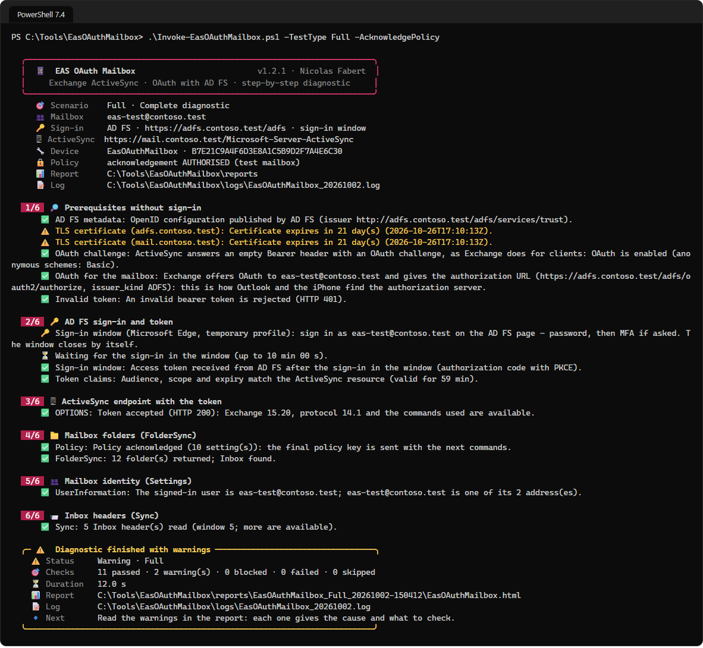

# EAS OAuth Mailbox — User guide

> What you need to run a test, and how to read what comes back: **are the prerequisites in place?**, **is the token issued, then accepted by Exchange?**, **does a test mailbox work end to end?**, **why does an iPhone not connect?** Each step gives the command to copy and what you should see. The three sign-in paths with the AD FS, Entra ID and Exchange configuration they expect, every setting, each check in detail, the architecture and the full troubleshooting tables are in the [developer guide](EasOAuthMailbox-Guide.md).

> [!IMPORTANT]
> Files downloaded from the Internet may be blocked by Windows and fail to run. Before using this project, unblock every file in the downloaded folder:
>
> ```powershell
> Get-ChildItem "C:\Chemin\Du\Dossier" -Recurse -File -Force | Unblock-File
> ```
>
> Replace the example path with the folder where you downloaded or extracted this project.

```cards
checklist | Prerequisites | Chapter 1: the workstation, the browser, the network, the test mailbox — and what Exchange needs for the path you test.
download | Install | Chapter 2: extract the zip, unblock the files, fill in the configuration.
play | Run a test | Chapters 3 and 4: the window, the command line, and which scenario to choose.
chart | Read the result | Chapter 5: the console, the report and the files produced.
```

# Part I · Start here

<!-- icon: checklist -->
## 1. Prerequisites

| Item | Requirement |
|---|---|
| Workstation | Windows 10 / 11 or Windows Server 2016 to 2025, **PowerShell 7.4** or later (7.5 or later for the Windows 11 look of the window). No module to install. |
| Browser | Microsoft Edge or Google Chrome, for the sign-in window. Without one, a device code is shown instead. |
| Network | HTTPS to the ActiveSync URL, and to AD FS or `login.microsoftonline.com` |
| Account | A **test mailbox** and its password (and its MFA). From `FolderSync` on, Exchange registers an ActiveSync device partnership for it. |

And on the Exchange side, for the sign-in method you test:

| Sign-in method | Exchange side |
|---|---|
| **OAuth - On-prem AD FS** | Exchange Server 2019 CU13+ or SE configured for modern authentication with AD FS (AD FS on Windows Server 2019 or later), and an authentication policy that allows it for the user |
| **OAuth - Entra ID** | Exchange on-premises in hybrid with modern authentication (HMA) enabled, or a mailbox in Exchange Online |
| **Basic - On-prem** | Basic authentication allowed on the ActiveSync virtual directory |

> [!TIP]
> **Install PowerShell 7 on a server with the MSI** (`PowerShell-7.x-win-x64.msi`), not with `winget`, which installs the Store package from 7.6. Without installation rights, the ZIP works too: unzip it and run `pwsh.exe`.

On **Server Core**, or in any session without a desktop, no sign-in window can open: the run shows a **device code** to type on another device. On **Windows Server 2016**, install Edge or use the device code.

<!-- icon: download -->
## 2. Install

1. Download `EasOAuthMailbox-<version>.zip` from the [latest release](https://github.com/Nico77600/EasOAuthMailbox/releases/latest) and extract it, for example in `C:\Tools` (or copy the repository `package` folder).
2. Unblock the files (command at the top of this page).
3. Open `config\EasOAuthMailbox.config.psd1` in Notepad and replace the `contoso.test` values: the test mailbox, the ActiveSync URL and, with AD FS, the AD FS URL. Every value can also be typed in the window or given on the command line.

The values to fill in first:

| Key | Role |
|---|---|
| `Target.Mailbox` | Test mailbox (SMTP or UPN). |
| `Target.EasUrl` | ActiveSync URL published to the devices. For Exchange Online: `https://outlook.office365.com/Microsoft-Server-ActiveSync`. |
| `Target.Authority` | `ADFS` (default), `EntraID` or `Auto` — the server Exchange names. |
| `Target.AdfsUrl` | AD FS root, ends with `/adfs`. Only with `Authority = 'ADFS'`. |
| `Target.TenantId` | Entra ID: tenant ID or domain. Empty: the domain of the mailbox. |

An unknown key is rejected and **every** configuration error is listed at once on start. Relative paths start from the tool folder, and `-ConfigPath` selects another file — one per site or per lab.

> [!CAUTION]
> **No secret in this file.** The OAuth sign-in is interactive and the token stays in memory. The Basic password is asked at each run and never saved.

# Part II · Everyday use

<!-- icon: people -->
## 3. The window

```powershell
cd C:\Tools\EasOAuthMailbox-1.2.1
.\Invoke-EasOAuthMailbox.ps1 -Gui
```

Choose the sign-in method, check the mailbox and the URLs, choose the scenario, then **Run the test**. With OAuth, a sign-in window opens: type the password and the MFA there.


**Run the test** checks every value first (errors in *Progress*, nothing sent), then runs; **Cancel** stops at the next check. **Open the report** and **Open the folder** after a run. Nothing is saved, the password never.

<!-- icon: terminal -->
## 4. The command line

What is not given comes from the configuration file:

```powershell
# Without signing in: certificates, OAuth challenge, and which sign-in Exchange offers this mailbox
.\Invoke-EasOAuthMailbox.ps1 -TestType Discovery -Mailbox eas-test@contoso.com

# Complete test of a test mailbox, with each sign-in method
.\Invoke-EasOAuthMailbox.ps1 -TestType Full -AcknowledgePolicy                          # OAuth - On-prem AD FS
.\Invoke-EasOAuthMailbox.ps1 -TestType Full -Authority EntraID -AcknowledgePolicy       # OAuth - Entra ID, Exchange on-premises (HMA)
.\Invoke-EasOAuthMailbox.ps1 -TestType Full -Authority EntraID -AcknowledgePolicy -EasUrl https://outlook.office365.com/Microsoft-Server-ActiveSync   # OAuth - Entra ID, Exchange Online
.\Invoke-EasOAuthMailbox.ps1 -TestType Full -Authentication Basic -AcknowledgePolicy    # Basic - On-prem (the password is asked)

# Like an iPhone: only the address, the rest comes from Autodiscover and Exchange
.\Invoke-EasOAuthMailbox.ps1 -TestType AppleMail -Mailbox eas-test@contoso.com -AcknowledgePolicy
```

Which scenario?

| You want to... | Scenario |
|---|---|
| check the prerequisites before opening to users, or understand why nothing works | `Discovery` — no sign-in, nothing created |
| know whether the token is issued, then accepted by Exchange | `Endpoint` |
| accept a test mailbox from end to end | `Full` |
| understand why an iPhone does not connect | `AppleMail` |

`FolderSync`, `Provisioning`, `Identity`, `InboxSync` and `OAuth` run a part of the same path; `Full` chains Discovery, the sign-in, Endpoint, FolderSync, Identity and InboxSync. Every scenario from `FolderSync` on registers the test device in Exchange.

Good to know:

- Not sure where the user signs in? `-Authority Auto` goes where Exchange sends the user, like a client.
- On a server without a browser, add `-SignIn DeviceCode`: type the code on any other device (a private window if the browser is signed in with another account).
- Without `-AcknowledgePolicy`, when Exchange requires a policy, it is only downloaded for review and the run stops as *Blocked*.
- Useful overrides for one run: `-Mailbox`, `-EasUrl`, `-AdfsUrl`, `-TenantId`, `-MessageCount`, `-OutputPath`, `-ConfigPath`; `-NoReport` keeps the console and the log only.



<!-- icon: chart -->
## 5. Read the result

- The console shows each check as it runs, then the verdict and the path of the report.
- The report is `reports\EasOAuthMailbox_<scenario>_<date>\EasOAuthMailbox.html`: each check that fails says what to look at, with the request sent and the response received. The CSV and JSON files are next to it.
- Exit code: `0` passed, `1` failed, `2` warnings or blocked.
- Exchange then lists the test device: `Get-MobileDevice -Mailbox <mailbox>`; remove it with `Remove-MobileDevice` once the test is over.


**Read the report from the top and stop at the first red or orange check.** A box at the top repeats the first *Failed* or *Blocked* one; the *Scope* panel shows the mailbox, the signed-in user, the authorisation server, the ActiveSync URL, the device, and the scope and client of the token. Click a check for everything kept — HTTP code, `x-ms-diagnostics`, certificate, token claims — then its HTTP exchanges. The tabs *All checks*, *Folders*, *Inbox headers*, *Policy* and *HTTP trace* can be searched, sorted and exported to CSV.

| Status | Meaning |
|---|---|
| **Passed** | The check got exactly what was expected. |
| **Warning** | The path continues, but something needs action: certificate close to expiry, unexpected audience, another user… |
| **Blocked** | Exchange requires the ActiveSync policy to be acknowledged and it was not authorised. **Not** an authentication failure: read the *Policy* tab, then run again with `-AcknowledgePolicy` on the test mailbox. |
| **Failed · Skipped** | A failure stops the scenario; the next stages are *Skipped* (not run), never failed. |

Each run creates one folder, `EasOAuthMailbox_<scenario>_<date>`, under `reports\`:

| File | Content |
|---|---|
| `…-Steps.csv` | One check per line: stage, name, status, message, details, duration, time, HTTP exchanges. |
| `…-Folders.csv` · `…-Messages.csv` · `…-Policy.csv` | Folders · Inbox headers · ActiveSync policy returned by Exchange. |
| `…-Trace.csv` | One HTTP exchange per line, full request and response, secrets masked. |
| `…-Summary.json` | The full result, for a script. |
| `….html` | The self-contained report. |
| `logs\EasOAuthMailbox_yyyyMMdd.log` | The console lines of the day, plus one line per HTTP request. |

> [!IMPORTANT]
> **No secret in the trace.** Tokens, device code, authorisation code and cookies are replaced by their length; for Basic only the user name is kept. Reports do contain addresses and subjects: protect them as messaging data.

# Part III · Troubleshoot

<!-- icon: lifebuoy -->
## 6. If something does not work

| Symptom | Cause and action |
|---|---|
| A configuration message on start (`Target.AdfsUrl must end with /adfs`…) | The value named; every error is listed at once. Fix `config\EasOAuthMailbox.config.psd1`. |
| *TLS certificate*: *No direct TLS connection* · *not trusted* | Normal behind a proxy, otherwise DNS or firewall · chain not trusted, name missing, expired. |
| *OAuth challenge*: HTTP 451 | Exchange redirects the mailbox to another ActiveSync URL (`X-MS-Location`): test this one. To Exchange Online: the mailbox was moved, test it with `-Authority EntraID -EasUrl https://outlook.office365.com/Microsoft-Server-ActiveSync`. |
| *OAuth challenge*: no `Bearer`, or another server | AD FS: `OAuth` missing on the ActiveSync virtual directory, no `New-AuthServer -Type ADFS`, `OAuth2ClientProfileEnabled` at `$false`, or a proxy that removes the header. Entra ID: HMA not enabled. |
| *OAuth for the mailbox* failed (`oauth_not_available`) | The authentication policy of the user blocks modern authentication for ActiveSync — the iPhone then asks for a password: `Get-User <mailbox> \| Format-List AuthenticationPolicy`, then `Set-User -AuthenticationPolicy`; wait 30 minutes or `iisreset`. |
| *Invalid token* failed | A forged token is accepted: check the publishing chain now (pre-authenticating proxy, bypass rule). |
| *No sign-in window here* · *The sign-in window could not start* | No desktop session, neither Edge nor Chrome, or a browser policy: the device code is used instead. `-SignIn Window` makes it an error. |
| Device code: the page stays on *Trying to sign you in* | The browser is signed in with another account: open the page in a **private window**, or use the sign-in window. |
| *Entra ID tenant* failed (`AADSTS90002`) | The domain is not a verified domain of a tenant: pass `-TenantId contoso.onmicrosoft.com`. |
| *Endpoint*: HTTP 401 | Read *Exchange diagnostics* in the report: audience, issuer not trusted (`Get-AuthServer`), policy of the user. Wait 30 minutes or `iisreset` after a change. |
| *Endpoint*: HTTP 403 | User or device blocked: `Get-CASMailbox <mailbox> \| Format-List ActiveSync*`, device access rules, quarantine. |
| **Blocked** | Expected without authorisation: read the *Policy* tab, then `-AcknowledgePolicy` on the test mailbox. |
| *Identity* as warning | The signed-in user is not the test mailbox: account used in the browser, UPN different from the SMTP address. |
| *InboxSync*: *No Inbox* | `FolderSync` returned no Inbox: mailbox not initialised, or rights. |
| Clean the test devices | `Get-MobileDevice -Mailbox <mailbox> \| Where-Object DeviceType -eq 'EasOAuthMailbox' \| Remove-MobileDevice`; *AppleMail*: `Where-Object FriendlyName -like 'iPhone (EAS OAuth Mailbox*'`. |

Anything else — AD FS and Entra ID messages one by one, Basic, ActiveSync statuses and HTTP codes: [developer guide, Appendix A](EasOAuthMailbox-Guide.md#appendix-a---troubleshooting) and [Appendix B](EasOAuthMailbox-Guide.md#appendix-b---http-codes-and-activesync-statuses).
